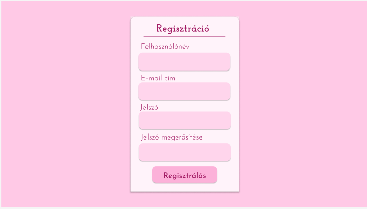
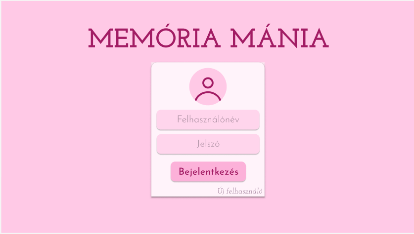
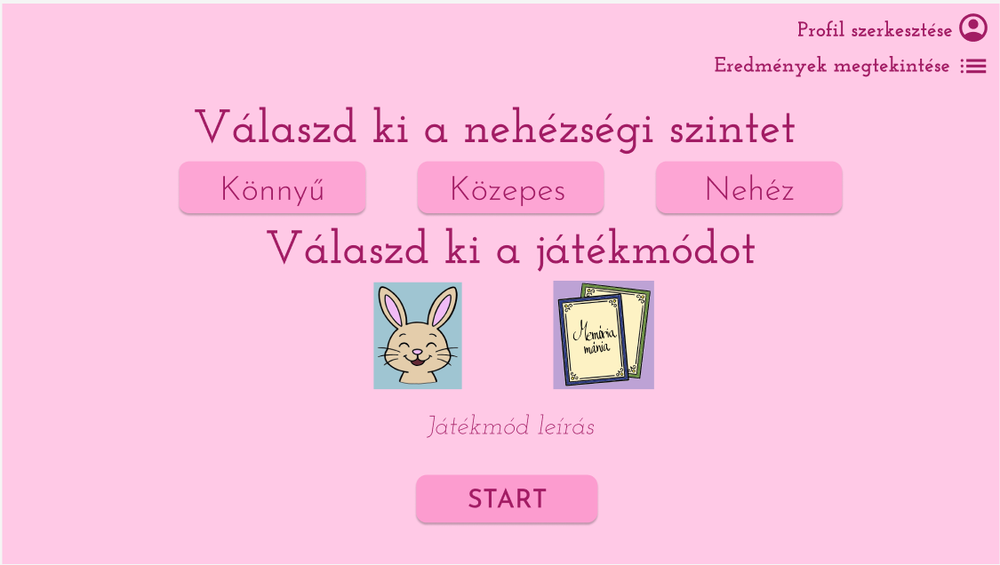
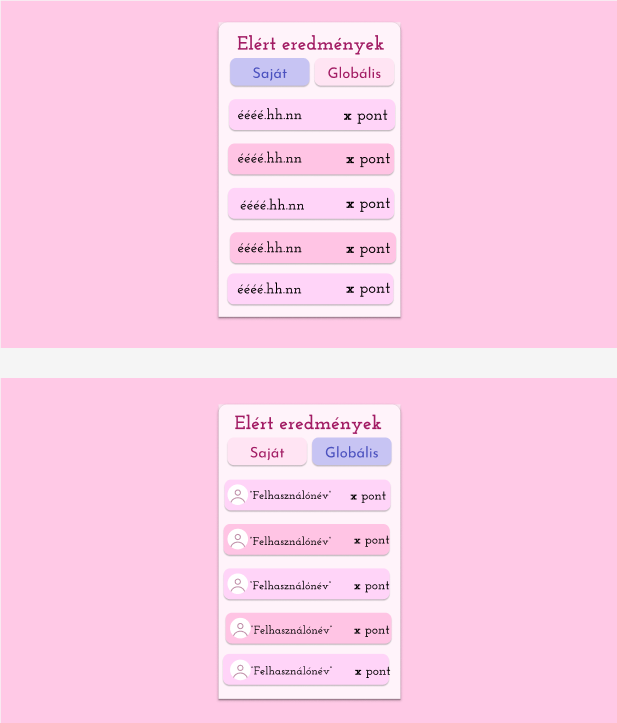
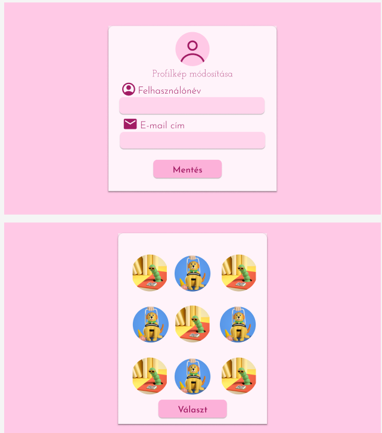

# Funkcionális Specifikáció

## 1. Áttekintés:

- Egy olyan játékot fejleszt a csapatunk aminek célja a fiatalok vagy akár az idősek kognitív képességeit fejleszteni. Játék több játékmódot fed le ami lehetőséget ad a játékos memória fejlesztésre vagy akár a nyelvtanulásra. A játékos regisztrálhat egy felületen keresztül és utána bejelentkezhet hogy megméresse magát a többi játékossal. A játékot több játékos módon tudják futtatni a weben hogy a verseny szellem kialakuljon a játékosok között. Ez a játék teljesen ingyenes lesz, ezért bárki hozzá tud férni majd és egyszerű regisztráció után már játszhat is. Minden ilyen játék után az adott személy láthatja, hogy mennyi pontot szerzett,illetve a többi játékosnak mennyi pontja van és mint ez egy vissza igazolást ad a számára, hogy mennyire sikerült fejleszteni a logikai, kognitív képességeit.

## 2. Jelenlegi helyzet:

- A jelenlegi rendszert szeretnénk kibőviteni egy regisztrációs és bejelentkezési felülettel.Több játékmódot is szeretnénk belevinni hogy élvezetesebb és sokszínűbb legyen a felhasználók számára. Egyenlőre a játékosok még csak nevet tudnak maguknak választani és utánna játékmódot. Ezt szeretnénk kicsit interaktívabbá tenni illetve szerethetőbbé. Ami azt jelenti hogy 21. századnak megfelelően a weben mindenki számára elérhető játékot szeretnénk nyújtan kicsiknek nagyoknak egyaránt.Maga a pont kiírása csak jelenlegi játék inditás utáni pontot mutat de később elérhető lesz egy scoreboard ami segíti felhasználók verseny szellemét felébreszteni.

## 3. Követelménylista:

| Modul   | ID  | Név                          | Verzió | Kifejtés                                                                 |
| ------- | --- | ---------------------------- | ------ | ------------------------------------------------------------------------ |
| Backend | K1  | Flask alapú szerver          | 1.0    | Python Flask keretrendszer használata a backend kiszolgálásához          |
| Backend | K2  | REST API végpontok           | 1.0    | 3 REST végpont implementálása (pl. /api/scores, /api/newgame, /api/save) |
| Backend | K3  | Adatvalidáció                | 1.0    | Bejövő adatok validálása a szerver oldalon                               |
| Backend | K4  | Egyszerű routing             | 1.0    | 2 különböző útvonal kezelése (pl. /, /game, /scores)                     |
| Backend | K5  | Statikus fájlok kiszolgálása | 1.0    | CSS, JS és képfájlok kiszolgálása a Flask segítségével                   |
| HTML    | K6  | HTML5 szerkezet              | 1.0    | Modern HTML5 szerkezet használata semantic elemekkel                     |
| HTML    | K7  | Reszponzív design            | 1.0    | Oldal reszponzív legyen különböző képernyőméretekre                      |
| HTML    | K8  | Accessibility                | 1.0    | Alapvető accessibility követelmények betartása (ARIA attribútumok)       |
| HTML    | K9  | Meta tag-ek                  | 1.0    | Megfelelő meta tag-ek használata (viewport, charset, description)        |
| HTML    | K10 | Form elemek                  | 1.0    | Legalább 1 form elem használata (pl. név megadása játék elején)          |
| CSS        | K11 | Grid vagy Flexbox         | 1.0    | Modern elrendezési technológiák használata a kártyák elrendezéséhez      |
| CSS        | K12 | Animációk                 | 1.0    | CSS animációk implementálása a kártyafordításhoz                         |
| CSS        | K13 | Reszponzív design (CSS)   | 1.0    | Media query-k használata különböző képernyőméretekhez                    |
| CSS        | K14 | Átlátható kódstruktúra    | 1.0    | Jól szervezett CSS, következetes naming convention                       |
| CSS        | K15 | Kártya design             | 1.0    | Esztétikus kártya design előoldallal és hátoldallal                      |
| JavaScript | K16 | DOM manipuláció           | 1.0    | JavaScript alapú DOM manipuláció a kártyák kezeléséhez                   |
| JavaScript | K17 | Eseménykezelés            | 1.0    | Egérkattintás és eseménykezelés a kártyákhoz                             |
| JavaScript | K18 | Időzítők                  | 1.0    | setTimeout/setInterval használata a játéklogikához                       |
| JavaScript | K19 | Fetch API                 | 1.0    | Fetch használata a backend kommunikációhoz                               |
| JavaScript | K20 | Játékállapot kezelés      | 1.0    | Játékállapot nyomon követése JavaScript                                  |
| CSS       | K21 | Egységes design         | 1.0    | Következetes színskála és design a teljes alkalmazásban                 |
| CSS       | K22 | Kártya design           | 1.0    | Esztétikus és felhasználóbarát kártya design                            |
| CSS       | K23 | Typography              | 1.0    | Olvasható és megfelelő méretű betűtípusok használata                    |
| CSS       | K24 | Reszponzív design       | 1.0    | Design, amely minden eszközön jól működik                               |
| CSS       | K25 | Interakció visszajelzés | 1.0    | Vizualizáció a felhasználói interakciókról (hover, click stb.)          |
| Backend   | K26 | Dokumentáció            | 1.0    | A kód megfelelő kommentelése és dokumentálása                           |
| Backend   | K27 | Verziókövetés           | 1.0    | Git használata a verziókövetéshez                                       |
| Backend   | K28 | Hibakezelés             | 1.0    | Alapvető hibakezelés implementálása                                     |
| Backend   | K29 | Böngésző kompatibilitás | 1.0    | Támogatás a legfrissebb böngészőkben                                    |
| Backend   | K30 | Teljesítmény            | 1.0    | Optimális teljesítmény és gyors betöltési idők                          |
| Adatbázis | K31 | Táblatervezés           | 1.0    | Legalább 2 tábla létrehozása (pl. players, scores)                      |
| Adatbázis | K32 | Adatintegritás          | 1.0    | Megfelelő mezőtípusok és kulcsok használata                             |
| Adatbázis | K33 | CRUD műveletek          | 1.0    | Create, Read, Update, Delete műveletek implementálása                   |
| Adatbázis | K34 | Kapcsolatok             | 1.0    | Táblák közötti kapcsolatok kialakítása                                  |
| Adatbázis | K35 | Adatbiztonság           | 1.0    | Alapvető adatbiztonsági intézkedések (SQL injection védelem)            |
| Auth | K36 | Felhasználó regisztráció	  | 1.1    | Regisztrációs rendszer email és felhasználónév ellenőrzéssel            |
| Auth | K37 | Bejelentkezési rendszer		  | 1.1    | Biztonságos bejelentkezés session kezeléssel           |
| Auth | K38 | Jelszó titkosítás		  | 1.1    | Werkzeug Security használata jelszavak hash-elésére           |
| Auth | K39 | Session kezelés		  | 1.1    | Flask session management a felhasználói állapot követésére     |
| Auth | K40 | Kijelentkezés		  | 1.1    | Session törlés és biztonságos kijelentkezés     |
| Game | K41 | Több játékmód		  | 1.1    | Color Hunter és Card Match játékmódok implementálása    |
| Game | K42 | Nehézségi szintek		  | 1.1    | Easy, Medium, Hard nehézségi szintek különböző paraméterekkel   |
| Game | K43 | Game Session kezelés			  | 1.1    | Játék session-ök nyomon követése start/end időpontokkal  |
| Game | K44 | Valós idejű játékállapot		  | 1.1    | Játékállapot frissítése minden körben  |
| Game | K45 | Időmérés	  | 1.1    | 	Játékidő mérése és rögzítése  |
| Scores | K46 | Részletes statisztikák	  | 1.1    | 	Játékidő, körök száma, pontszám részletes rögzítése  |
| Scores | K47 | Szűrhető ranglista		  | 1.1    | 	Eredmények szűrése játékmód és nehézség szerint |
| Scores | K48 | Játékos profilok	  | 1.1    | 	Játékos statisztikák (legtöbb játék, legjobb pontszám) |
| Scores | K49 | Valós idejű eredményfrissítés	  | 1.1    | 	Eredmények azonnali megjelenítése mentés után |
| Scores | K50 | Toplisták  | 1.1    | 	Legjobb játékosok listázása különböző kategóriákban |
| Testing | K51 | Unit tesztek  | 1.1    | 	Backend funkciók unit tesztelése Python unittest modullal |
| Testing | K52 | Integrációs tesztek | 1.1    | 	API végpontok integrációs tesztelése |
| Testing | K53 | Mock adatbázis kapcsolat	| 1.1    | 	Tesztkörnyezet mock objektumokkal |
| Testing | K54 | Teszt konfiguráció		| 1.1    | 	Külön teszt konfiguráció és adatbázis |
| Testing | K55 | Automatikus tesztfuttatás			| 1.1    | 	Tesztcsomagok automatikus futtatása és jelentés generálás |
| Backend | K56 | RESTful API design			| 1.1    | 	Megfelelő HTTP státuszkódok és REST konvenciók használata |
| Backend | K57 | Komplex adatvalidáció			| 1.1    | 	Email, jelszó erősség, felhasználónév validáció |
| Backend | K58 | Környezeti konfiguráció		| 1.1    | 	.env fájl alapú konfiguráció kezelés |
| Backend | K59 | Adatbázis migráció		| 1.1    | 	Automatikus adatbázis inicializálás és séma frissítés |
| Backend | K60 | Hibakezelés és logging		| 1.1    | 	Részletes hibanaplózás és felhasználóbarát hibaüzenetek |
| Tech | K61 | Moduláris kódstruktúra		| 1.1    | 	Szeparált router, model, utility modulok |
| Tech | K62 | Biztonsági intézkedések			| 1.1    | 	SQL injection védelem, XSS prevention |
| Tech | K63 | Teljesítmény optimalizálás			| 1.1    | 	Adatbázis kapcsolat pooling, query optimalizálás |
| Tech | K64 | Skálázhatóság			| 1.1    | 	Tervezési minták alkalmazása bővítéshez |
| Tech | K65 | Kódminőség			| 1.1    | Clean code, következetes naming convention, code documentation |

## 4. Jelenlegi üzleti folyamatok modellje:
 - A mai modern világban kevésbé fontos a kongnitív memória illetve fejlesztő szakemberek nem annyira hásználják ki a technológia adott lehetőségeket. A mai fiatalság és az új generáció egyre fogékonyabb a technológia adott lehetőség kihasználásra és egyre nagyobb webalkalmazás felhasználás jellemezőbb rájuk az elmúlt évtizedben. A szakemberek sok kártya alapú illetve lap alapú kongnitív fejlesztő eszközöket használnak így ez rengeteg nyomdai és egyéb költséget jelent számukra. Ez a memória játékot nem csak számukra ajánljuk de nekik is kiváló lehetőség a memória fejlesztésre bizonyos segítségre szoruló gyerekek számára.
 Az emberiség egyre kevesebb energiát fordít a nyelvek megtanulására illetve rengeteg tanár még az elavult papír alapú módszert használja amit felválthat egy online szókártya rendszer is.

 ## 5. Igényelt üzleti folyamatok modellje:
 - Mind a gyermekek mind a felnőttek számára szeretnénk egy lehetőséget, játékot biztosítani a kongntiv területek fejlesztésére. Memória fejlesztése nagyon fontos terület kiskorban ezért ez szertnénk minél színesebben és érdekesebben megfogni a felhasználók számára. Ezekhez állatos memóriakártyák és színes felhaszálói felület nyújt segíteséget. Kis gyermekek figyelmét és finom motorikáját tudja fejleszteni ez a játék illetve nyelvtanulásra is lehetőséget ad. Rendelkezik egy regisztrációs és egy avatar választós felülettel ami verseny szellemt építhet fel a felhasználóban. A rendszer lehetőséget ad ha később úgy dönt a felhasználó hogy megunta profilképét vagy a felhasználónevét akkor meg is változtathatja. Ez a funkció elég nagy testreszabást enged meg a felhasználóknak ami nagyon kevés játék esetén áll fent.

 ## 6. Használati esetek:
 - **Admin:**  
       - Az ADMIN beléphet játékos szerepkörbe, hogy az hibamentes működését ellenőrizhesse. Az Admin(ok) feladata a rendszer problémamentes működése. Ez egyben jár azzal, hogy az egész rendszerhez van hozzáférésük. Adminisztráációs jogosultásug van mint például: összes felhasználó megtekintése,felhasználói profilok kezelése,játékos adatainak módosítása.Láthatja az összes játék eredményét és eltávolíthatja hibás vagy nem megfelelő eredményeket.Ellenőrizheti és kezelheti a ranglistát. Játék beállítási jogal is rendelkezik mint például:játék módok kezelése, nehézségi szintek módosítása és pontozási rendszer beállítása. Ez a szerepkör rendelkezik statisztikai funkciókal is. Rendszerstatisztikát is nyomon tudja követni például: aktív felhasználók számának nyomon követése,legnépszerűbb játékmódok elemzése és átlagos játékidők és pontszámok megtekintése. A teljesítmény szempontjából is tudja monitorizni az alkalmazást mint a problémás játék területeket fel tudja deríteni. Rendszerfegyület funkcióval is rendelkezik: adatbázis karbantartás, rendszer napló megtekintése.
 - **Játékos:**  
       - Játékos szerepkörben alapvető játékos funkcióval is rendelkezik mint például: név megadása, játékmód kiválasztása, nehézségi szint beállítása és azonnali start. Magával a játékkal képes játszani majd az elért pontjait láthatja egy ranglistán. Statisztikai elemzést képes elérni a pontszámai alapján mint: legjobb pontszám megtekintése, játszott játékok száma vagy éppen utolsó belépés ideje.Képes létrehozni játékos profilt illetve így el tudja menteni a statisztikáit egyéb esetben csak vendég játékosként képes játszani.Ebben az esetben csak ideiglenesen képes menteni a statisztikáit. Van lehetősége a játékos profilját testreszabni.Választhat avatart magának vagy módosíthatja a játékos a nevét. Adatvédelem szempontjából csak jelszóval képes az adott felhasználó hozzáférni az adataihoz.

 ## 7. Képernyőtervek:

## 8. Forgatókönyv:
 - Futási időben 3 szerelő figyelhető meg:
   -  Webalkalmazás
   - Játékos
   - Web service
 - Első szereplő a webalkalmazás ahol be tud jelentkezni a játékos és játszani tud játékkal ezzel lép ő interrakcióba. Bejelentkezve ki lehet választani a kívánt játékmódot és nehézséget majd a webalkalmazás a játék után megjelenti a felhasználó számára a ranglistát ahol láthatja a statisztikájá. Harmadik szereplő a web service aki kiszolgálja adattal a webalkalmazást illetve validációs és regisztrációs műveltekkel. A webservice felelős az adatbázisba való tarolásért és lekérésért ami a felhasználó adatait és elért pontjait jelenti.

## 9. Fogalomszótár:
 - Web-service: Különböző programnyelveken írt és különböző platformokon futó szoftveralkalmazások interneten keresztül történő adatcseréjére használt vebszolgáltatások.
 - Adatbázis: Az adatbázis egy szervezett és strukturált módon tárolt adatgyűjtemény, amely lehetővé teszi az adatok hatékony kezelését, módosítását és lekérdezését. Az adatokat általában táblákba rendezve tárolják, ahol a mezők meghatározzák az adatok típusát és szerkezetét. Az adatbázis-kezelő rendszerek biztosítják az adatok biztonságos tárolását, integritásának megőrzését, valamint a gyors és egyidejű hozzáférést több felhasználó számára.
 - Webalkalmazás: Egy olyan szoftver, amelyet webböngészőn keresztül érünk el, és amely szerverekkel kommunikálva teljesít komplex feladatokat. A hagyományos weboldaktól eltérően interaktív funkciókat kínál – például adatokat dolgoz fel, tárol és jelenít meg – anélkül, hogy a felhasználónak telepítenie kellene. A legtöbb modern webalkalmazás háromrétegű architektúrán alapul: felhasználói felület (böngésző), backend logika (szerver) és adatbázis.
 - Reszponzív design: Olyan weboldal-tervezési módszer, amely automatikusan alkalmazkodik a különböző méretű kijelzőkhöz (asztali monitor, tablet, mobil), hogy optimális megjelenést és használhatóságot biztosíson minden eszközön.
 - Adatintegritás: Az adatok pontosságát, hiánytalanságát és konzisztenciáját biztosítja tárolás és feldolgozás során.
 - Unit teszt: A programkód legkisebb, önálló egységeinek (pl. függvények, metódusok) automatizált tesztelésére szolgálnak, hogy ellenőrizzük a megfelelő működésüket.
 - Integrációs tesztek: Azt ellenőrzik, hogy a rendszer különböző moduljai vagy komponensei helyesen együttműködnek-e. A unit tesztekkel ellentétben nem az egyes részek önálló működését, hanem azok közötti kapcsolatokat és adatcserét tesztelik.