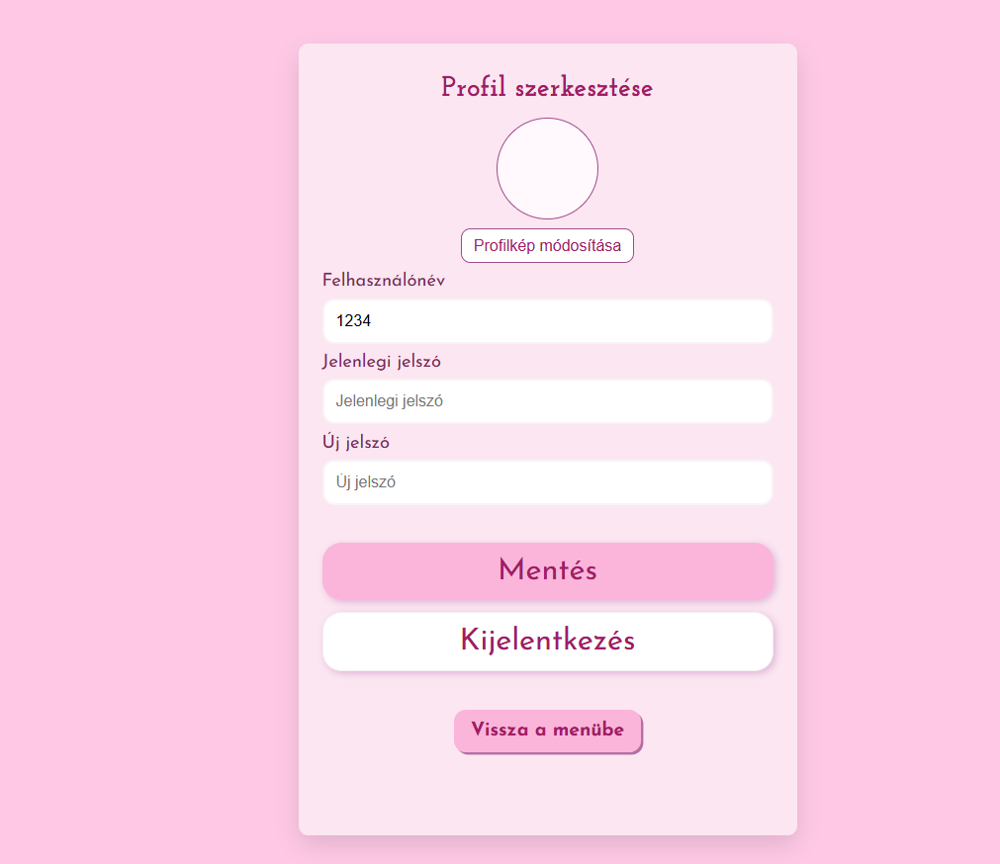

# Funkcionális Specifikáció

## 1. Áttekintés:

- Egy olyan játékot fejleszt a csapatunk aminek célja a fiatalok vagy akár az idősek kognitív képességeit fejleszteni. Játék több játékmódot fed le ami lehetőséget ad a játékos memória fejlesztésre. A játékos regisztrálhat egy felületen keresztül és utána bejelentkezhet hogy megméresse magát a többi játékossal. A játékot több játékos módon tudják futtatni a weben hogy a verseny szellem kialakuljon a játékosok között. Ez a játék teljesen ingyenes lesz, ezért bárki hozzá tud férni majd és egyszerű regisztráció után már játszhat is. Minden ilyen játék után az adott személy láthatja, hogy mennyi pontot szerzett,illetve a többi játékosnak mennyi pontja van és mint ez egy vissza igazolást ad a számára, hogy mennyire sikerült fejleszteni a logikai, kognitív képességeit. A rendszer egy harmadik játékmódot, a fraktál módot is tartalmazza. Ebben a módban a játékosnak egymáshoz nagyon hasonló, dinamikusan generált fraktál képek közül kell kiválasztania a párt. A fraktál mód célzottan fejleszti a vizuális megkülönböztető képességet, mintafelismerést és a koncentrációt, mivel a képek nem ismert, előre betanult motívumok (állatok, tárgyak), hanem folyamatosan változó, absztrakt minták.

## 2. Jelenlegi helyzet:

- A jelenlegi rendszert szeretnénk kibőviteni egy regisztrációs és bejelentkezési felülettel.Több játékmódot is szeretnénk belevinni hogy élvezetesebb és sokszínűbb legyen a felhasználók számára. Egyenlőre a játékosok még csak nevet tudnak maguknak választani és utánna játékmódot. Ezt szeretnénk kicsit interaktívabbá tenni illetve szerethetőbbé. Ami azt jelenti hogy 21. századnak megfelelően a weben mindenki számára elérhető játékot szeretnénk nyújtan kicsiknek nagyoknak egyaránt.Maga a pont kiírása csak jelenlegi játék inditás utáni pontot mutat de később elérhető lesz egy scoreboard ami segíti felhasználók verseny szellemét felébreszteni. Kedves játékosnak lehetősége lesz avatárt választani magának illetve, profiladatai módosíthatja igényeinek megfelelően.

## 3. Követelménylista:

| Modul   | ID  | Név                          | Verzió | Kifejtés                                                                 |
| ------- | --- | ---------------------------- | ------ | ------------------------------------------------------------------------ |
| Backend | K1  | Flask alapú szerver          | 1.0    | Python Flask keretrendszer használata a backend kiszolgálásához          |
| Backend | K2  | REST API végpontok           | 1.0    | 3 REST végpont implementálása (pl. /api/scores, /api/newgame, /api/save) |
| Backend | K3  | Adatvalidáció                | 1.0    | Bejövő adatok validálása a szerver oldalon                               |
| Backend | K4  | Egyszerű routing             | 1.0    | 2 különböző útvonal kezelése (pl. /, /game, /scores)                     |
| Backend | K5  | Statikus fájlok kiszolgálása | 1.0    | CSS, JS és képfájlok kiszolgálása a Flask segítségével                   |
| Backend | K6  | Dokumentáció                 | 1.0    | A kód megfelelő kommentelése és dokumentálása                           |
| Backend | K7  | Verziókövetés                | 1.0    | Git használata a verziókövetéshez                                       |
| Backend | K8  | Hibakezelés                  | 1.0    | Alapvető hibakezelés implementálása                                     |
| Backend | K9  | Böngésző kompatibilitás      | 1.0    | Támogatás a legfrissebb böngészőkben                                    |
| Backend | K10 | Teljesítmény                 | 1.0    | Optimális teljesítmény és gyors betöltési idők                          |
| HTML    | K11 | HTML5 szerkezet              | 1.0    | Modern HTML5 szerkezet használata semantic elemekkel                     |
| HTML    | K12 | Reszponzív design            | 1.0    | Oldal reszponzív legyen különböző képernyőméretekre                      |
| HTML    | K13 | Accessibility                | 1.0    | Alapvető accessibility követelmények betartása (ARIA attribútumok)       |
| HTML    | K14 | Meta tag-ek                  | 1.0    | Megfelelő meta tag-ek használata (viewport, charset, description)        |
| HTML    | K15 | Form elemek                  | 1.0    | Legalább 1 form elem használata (pl. név megadása játék elején)          |
| CSS     | K16 | Grid vagy Flexbox            | 1.0    | Modern elrendezési technológiák használata a kártyák elrendezéséhez      |
| CSS     | K17 | Animációk                    | 1.0    | CSS animációk implementálása a kártyafordításhoz                         |
| CSS     | K18 | Reszponzív design (CSS)      | 1.0    | Media query-k használata különböző képernyőméretekhez                    |
| CSS     | K19 | Átlátható kódstruktúra       | 1.0    | Jól szervezett CSS, következetes naming convention                       |
| CSS     | K20 | Kártya design                | 1.0    | Esztétikus kártya design előoldallal és hátoldallal                      |
| CSS     | K21 | Egységes design              | 1.0    | Következetes színskála és design a teljes alkalmazásban                 |
| CSS     | K22 | Kártya design                | 1.0    | Esztétikus és felhasználóbarát kártya design                            |
| CSS     | K23 | Typography                   | 1.0    | Olvasható és megfelelő méretű betűtípusok használata                    |
| CSS     | K24 | Reszponzív design            | 1.0    | Design, amely minden eszközön jól működik                               |
| CSS     | K25 | Interakció visszajelzés      | 1.0    | Vizualizáció a felhasználói interakciókról (hover, click stb.)          |
| CSS     | K26 | CSS 3D transzformációk       | 1.0    | Kártya forgatás animáció 3D transzformációval                            |
| CSS     | K27 | CSS transition animációk     | 1.0    | Hover, click, flip animációk transition-ökkel                            |
| JavaScript | K28 | DOM manipuláció              | 1.0    | JavaScript alapú DOM manipuláció a kártyák kezeléséhez                   |
| JavaScript | K29 | Eseménykezelés               | 1.0    | Egérkattintás és eseménykezelés a kártyákhoz                             |
| JavaScript | K30 | Időzítők                     | 1.0    | setTimeout/setInterval használata a játéklogikához                       |
| JavaScript | K31 | Fetch API                    | 1.0    | Fetch használata a backend kommunikációhoz                               |
| JavaScript | K32 | Játékállapot kezelés         | 1.0    | Játékállapot nyomon követése JavaScript                                  |
| JavaScript | K33 | Error handling frontend      | 1.0    | Try-catch blokkok és felhasználóbarát hibaüzenetek kezelése              |
| JavaScript | K34 | State management             | 1.0    | Játékállapot kezelése (score, moves, timer, selected cards)              |
| JavaScript | K35 | Test data attributes         | 1.0    | data-cy attribútumok tesztelhetőséghez                                  |
| JavaScript | K36 | Képkezelés                   | 1.0    | Dinamikus képbetöltés és megjelenítés játékban                           |
| JavaScript | K37 | Shuffle algoritmus           | 1.0    | Véletlenszerű keverés kártyák és képek esetén                            |
| JavaScript | K38 | Körönkénti játékmenet        | 1.0    | Round-based gameplay több körös játékhoz                                 |
| JavaScript | K39 | Lépésszámolás                | 1.0    | Moves counter játékban                                                   |
| JavaScript | K40 | Nehézség alapú játékparaméterek | 1.0 | Dinamikus játékparaméterek nehézség szerint (idő, párok száma)          |
| JavaScript | K41 | Kártya lock mechanizmus      | 1.0    | Kártya flip lock animáció alatt párosításkor                             |
| JavaScript | K42 | Kártya match animáció        | 1.0    | Vizualizáció párosított kártyáknál                                       |
| JavaScript | K43 | Kép választási UI            | 1.0    | Interaktív képválasztó felület Color Hunter játékban                     |
| JavaScript | K44 | Játékmód választó UI         | 1.0    | Interaktív játékmód és nehézség választó felület                         |
| Adatbázis | K45 | Táblatervezés                | 1.0    | Legalább 2 tábla létrehozása (pl. players, scores)                      |
| Adatbázis | K46 | Adatintegritás               | 1.0    | Megfelelő mezőtípusok és kulcsok használata                             |
| Adatbázis | K47 | CRUD műveletek               | 1.0    | Create, Read, Update, Delete műveletek implementálása                   |
| Adatbázis | K48 | Kapcsolatok                  | 1.0    | Táblák közötti kapcsolatok kialakítása                                  |
| Adatbázis | K49 | Adatbiztonság                | 1.0    | Alapvető adatbiztonsági intézkedések (SQL injection védelem)            |
| Auth    | K50 | Felhasználó regisztráció     | 1.1    | Regisztrációs rendszer email és felhasználónév ellenőrzéssel            |
| Auth    | K51 | Bejelentkezési rendszer      | 1.1    | Biztonságos bejelentkezés session kezeléssel                            |
| Auth    | K52 | Jelszó titkosítás            | 1.1    | Werkzeug Security használata jelszavak hash-elésére                     |
| Auth    | K53 | Session kezelés              | 1.1    | Flask session management a felhasználói állapot követésére              |
| Auth    | K54 | Kijelentkezés                | 1.1    | Session törlés és biztonságos kijelentkezés                             |
| Game    | K55 | Több játékmód                | 1.1    | Color Hunter és Card Match játékmódok implementálása                    |
| Game    | K56 | Nehézségi szintek            | 1.1    | Easy, Medium, Hard nehézségi szintek különböző paraméterekkel           |
| Game    | K57 | Game Session kezelés         | 1.1    | Játék session-ök nyomon követése start/end időpontokkal                 |
| Game    | K58 | Valós idejű játékállapot     | 1.1    | Játékállapot frissítése minden körben                                   |
| Game    | K59 | Időmérés                     | 1.1    | Játékidő mérése és rögzítése                                            |
| Scores  | K60 | Részletes statisztikák       | 1.1    | Játékidő, körök száma, pontszám részletes rögzítése                     |
| Scores  | K61 | Szűrhető ranglista           | 1.1    | Eredmények szűrése játékmód és nehézség szerint                         |
| Scores  | K62 | Játékos profilok             | 1.1    | Játékos statisztikák (legtöbb játék, legjobb pontszám)                  |
| Scores  | K63 | Valós idejű eredményfrissítés | 1.1   | Eredmények azonnali megjelenítése mentés után                           |
| Scores  | K64 | Toplisták                    | 1.1    | Legjobb játékosok listázása különböző kategóriákban                     |
| Testing | K65 | Unit tesztek                 | 1.1    | Backend funkciók unit tesztelése Python unittest modullal               |
| Testing | K66 | Integrációs tesztek          | 1.1    | API végpontok integrációs tesztelése                                    |
| Testing | K67 | Mock adatbázis kapcsolat     | 1.1    | Tesztkörnyezet mock objektumokkal                                       |
| Testing | K68 | Teszt konfiguráció           | 1.1    | Külön teszt konfiguráció és adatbázis                                   |
| Testing | K69 | Automatikus tesztfuttatás    | 1.1    | Tesztcsomagok automatikus futtatása és jelentés generálás               |
| Backend | K70 | RESTful API design           | 1.1    | Megfelelő HTTP státuszkódok és REST konvenciók használata               |
| Backend | K71 | Komplex adatvalidáció        | 1.1    | Email, jelszó erősség, felhasználónév validáció                         |
| Backend | K72 | Környezeti konfiguráció      | 1.1    | .env fájl alapú konfiguráció kezelés                                    |
| Backend | K73 | Adatbázis migráció           | 1.1    | Automatikus adatbázis inicializálás és séma frissítés                   |
| Backend | K74 | Hibakezelés és logging       | 1.1    | Részletes hibanaplózás és felhasználóbarát hibaüzenetek                 |
| Tech    | K75 | Moduláris kódstruktúra       | 1.1    | Szeparált router, model, utility modulok                                |
| Tech    | K76 | Biztonsági intézkedések      | 1.1    | SQL injection védelem, XSS prevention                                   |
| Tech    | K77 | Teljesítmény optimalizálás   | 1.1    | Adatbázis kapcsolat pooling, query optimalizálás                        |
| Tech    | K78 | Skálázhatóság                | 1.1    | Tervezési minták alkalmazása bővítéshez                                 |
| Tech    | K79 | Kódminőség                   | 1.1    | Clean code, következetes naming convention, code documentation          |
| Frontend | K80 | LocalStorage használat       | 1.1    | Játékos adatok (név, player_id, difficulty) tárolása böngészőben        |
| Frontend | K81 | Dinamikus DOM generálás      | 1.1    | JavaScript által generált HTML elemek (játékmód gombok)                 |
| Frontend | K82 | Async/await használat        | 1.1    | Modern aszinkron JavaScript műveletek kezelése                          |
| Frontend | K83 | Fetch API credentials        | 1.1    | Session cookie kezelés credentials: 'same-origin' beállítással          |
| Frontend | K84 | ARIA attribútumok            | 1.1    | Accessibility attribútumok (aria-live, aria-label, aria-modal, role)    |
| Frontend | K85 | Dinamikus CSS Grid           | 1.1    | JavaScript által beállított grid layout nehézség alapján                |
| Frontend | K86 | Külső font integráció        | 1.1    | Google Fonts használata (Josefin Sans, Josefin Slab)                    |
| Frontend | K87 | Időzítő funkcionalitás       | 1.1    | Countdown timer implementálása játékban                                 |
| Frontend | K88 | Játékállapot átmenetek       | 1.1    | State transitions (target -> choices -> result)                         |
| Frontend | K89 | Valós idejű pontszám követés | 1.1    | Score tracking real-time frissítéssel                                   |
| Frontend | K90 | Modal/Overlay dialógusok     | 1.1    | Eredmény képernyő overlay-ként                                          |
| Frontend | K91 | Oldal navigáció              | 1.1    | Oldalak közötti navigáció és routing                                    |
| Frontend | K92 | Játékos név megjelenítés     | 1.1    | Játékos nevének megjelenítése játékban                                  |
| Frontend | K93 | Ranglista megjelenítés       | 1.1    | Top 5 eredmények megjelenítése főoldalon                                |
| Frontend | K94 | Reszponzív grid layout       | 1.1    | Dinamikus grid nehézség alapján (2x3, 2x4, 3x4)                        |
| Backend | K95 | Health check endpoint        | 1.2    | /api/health végpont backend állapot ellenőrzéséhez                      |
| Backend | K96 | Context manager adatbázis kapcsolat | 1.2 | Biztonságos adatbázis kapcsolatkezelés context managerrel               |
| Backend | K97 | HTTP error handlers          | 1.2    | 404, 500, 405 HTTP hibák kezelése JSON válasszal                        |
| Backend | K98 | Blueprint moduláris struktúra | 1.2   | Flask Blueprint használata moduláris routinghoz                         |
| Backend | K99 | Transaction management       | 1.2    | Adatbázis tranzakciók kezelése rollback mechanizmussal                  |
| Backend | K100 | Adatbázis kapcsolat timeout  | 1.2    | Connect timeout beállítás adatbázis kapcsolathoz                        |
| Backend | K101 | Dátum/idő formázás           | 1.2    | ISO formátumú dátumok API válaszokban                                   |
| Backend | K102 | Játékmód validáció helper    | 1.2    | is_valid_game_mode és is_valid_difficulty helper függvények             |
| Backend | K103 | Entity validáció helper      | 1.2    | validate_entity_exists helper entitások létezésének ellenőrzéséhez      |
| Backend | K104 | Jelszó erősség értékelés     | 1.2    | validate_password_strength függvény jelszó erősség visszajelzéshez      |
| Backend | K105 | Adatbázis autocommit beállítás | 1.2  | Konfigurálható autocommit mód adatbázis műveletekhez                    |
| Auth    | K106 | Felhasználó profil frissítése | 1.2   | Felhasználónév és jelszó módosítás API végponttal                       |
| Auth    | K107 | Aktuális felhasználó lekérése | 1.2   | /api/current-user végpont session alapú felhasználó adatok lekéréséhez  |
| Auth    | K108 | Profilkép támogatás          | 1.2    | Felhasználói profilképek kezelése és tárolása                           |
| Auth    | K109 | Felhasználó aktivitás tracking | 1.2  | Last login és is_active mezők követése                                  |
| Game    | K110 | Vendég játékos támogatás     | 1.2    | Guest players létrehozása regisztráció nélkül                           |
| Game    | K111 | Játék session lekérése       | 1.2    | /api/game/session végpont aktív session információkhoz                  |
| Game    | K112 | Játék session befejezése     | 1.2    | /api/game/session/end végpont session lezárásához idővel                |
| Game    | K113 | Nehézségi beállítások helper | 1.2    | get_difficulty_settings helper függvény idő és párok számához           |
| Scores  | K114 | Komplex eredménylekérés      | 1.2    | Scope (global/me), szűrés, rendezés, lapozás támogatás                  |
| Scores  | K115 | Saját eredmények lekérése    | 1.2    | scope=me paraméter bejelentkezett felhasználó eredményeihez             |
| Scores  | K116 | Eredmények rendezése         | 1.2    | Több rendezési lehetőség (score, time, date) asc/desc                   |
| Scores  | K117 | Eredmények lapozása          | 1.2    | Pagination támogatás limit, page, offset paraméterekkel                 |
| Scores  | K118 | Játékosok listázása          | 1.2    | /api/players végpont játékosok statisztikákkal                          |
| Scores  | K119 | Játékos statisztikák automatikus frissítés | 1.2 | total_games_played, best_score automatikus frissítése                  |
| Adatbázis | K120 | Adatbázis indexek            | 1.2    | Teljesítmény optimalizálás indexekkel (username, email, score stb.)     |
| Adatbázis | K121 | Foreign key constraint-ek    | 1.2    | Adatintegritás biztosítása foreign key constraint-ekkel                 |
| Adatbázis | K122 | Adatbázis charset/collation  | 1.2    | UTF8MB4 charset és Hungarian collation támogatás                        |
| Adatbázis | K123 | Adatbázis séma verziókezelés | 1.2    | CREATE TABLE IF NOT EXISTS használata séma migrációhoz                  |
| Frontend | K124 | Client-side validáció        | 1.2    | Form validáció JavaScript-ben regisztráció és bejelentkezésnél          |
| Frontend | K125 | E2E tesztelés                | 1.2    | Cypress end-to-end tesztek frontend funkciókhoz                         |
| Frontend | K126 | Validációs visszajelzések    | 1.2    | Form validáció visszajelzések felhasználónak                            |
| Frontend | K127 | Loading state kezelés        | 1.2    | Betöltési állapotok kezelése API hívásoknál                             |
| Frontend | K128 | Navigációs linkek            | 1.2    | Profil szerkesztés és eredmények megtekintése linkek                    |
| Frontend | K129 | Jelszó megerősítés           | 1.2    | Jelszó megerősítő mező regisztrációnál                                  |
| Frontend | K130 | Autocomplete attribútumok    | 1.2    | Autocomplete támogatás bejelentkezési formoknál                         |
| Game    | K131 | Fraktál játékmód támogatása   | 1.3    | Új game_mode ('fractal') bevezetése, score mentéssel és játékmód validációval   |
| Frontend | K132 | Fraktál játékmód UI és logika | 1.3    | Fraktál mód megjelenítése a játékmódválasztóban, fraktál képpárok generálása és score küldése 'fractal' game_mode-dal |

## 4. Jelenlegi üzleti folyamatok modellje:
 - A mai modern világban kevésbé fontos a kongnitív memória illetve fejlesztő szakemberek nem annyira használják ki a technológia adott lehetőségeket. A mai fiatalság és az új generáció egyre fogékonyabb a technológia adott lehetőség kihasználásra és egyre nagyobb webalkalmazás felhasználás jellemezőbb rájuk az elmúlt évtizedben. A szakemberek sok kártya alapú illetve lap alapú kongnitív fejlesztő eszközöket használnak így ez rengeteg nyomdai és egyéb költséget jelent számukra. Ez a memória játékot nem csak számukra ajánljuk de nekik is kiváló lehetőség a memória fejlesztésre bizonyos segítségre szoruló gyerekek számára.

 
 ## 5. Igényelt üzleti folyamatok modellje:
 - Mind a gyermekek mind a felnőttek számára szeretnénk egy lehetőséget, játékot biztosítani a kongntiv területek fejlesztésére. Memória fejlesztése nagyon fontos terület kiskorban ezért ez szertnénk minél színesebben és érdekesebben megfogni a felhasználók számára. Ezekhez állatos memóriakártyák és színes felhaszálói felület nyújt segíteséget. Kis gyermekek figyelmét és finom motorikáját tudja fejleszteni ez a játék illetve nyelvtanulásra is lehetőséget ad. Rendelkezik egy regisztrációs és egy avatar választós felülettel ami verseny szellemt építhet fel a felhasználóban. A rendszer lehetőséget ad ha később úgy dönt a felhasználó hogy megunta profilképét vagy a felhasználónevét akkor meg is változtathatja. Ez a funkció elég nagy testreszabást enged meg a felhasználóknak ami nagyon kevés játék esetén áll fent.A rendszer a klasszikus memória- és színfelismerő játékmódok mellett egy fraktál alapú játékmódot is biztosít. A fraktál mód lényege, hogy a játékosnak egymáshoz nagyon hasonló, dinamikusan generált fraktál mintákat kell párokba rendeznie. Ennek gyakorlati haszna, hogy nem előre megtanulható, ismert képekre épít, hanem folyamatosan változó, absztrakt vizuális ingerekre, így célzottan fejleszti a vizuális megkülönböztető képességet, a mintafelismerést és a koncentrációt. Ez különösen hasznos lehet olyan fejlesztési helyzetekben, ahol a finom vizuális különbségek észlelése, a figyelmi terhelés és a tartós fókusz gyakorlása a cél.

 ## 6. Használati esetek:
 - **Admin:**  
       - Az ADMIN beléphet játékos szerepkörbe, hogy az hibamentes működését ellenőrizhesse. Az Admin(ok) feladata a rendszer problémamentes működése. Ez egyben jár azzal, hogy az egész rendszerhez van hozzáférésük. Adminisztrációs jogosultásug van mint például: összes felhasználó megtekintése,felhasználói profilok kezelése,játékos adatainak módosítása.Láthatja az összes játék eredményét és eltávolíthatja hibás vagy nem megfelelő eredményeket.Ellenőrizheti és kezelheti a ranglistát. Játék beállítási jogal is rendelkezik mint például:játék módok kezelése, nehézségi szintek módosítása és pontozási rendszer beállítása. Ez a szerepkör rendelkezik statisztikai funkciókal is. Rendszerstatisztikát is nyomon tudja követni például: aktív felhasználók számának nyomon követése,legnépszerűbb játékmódok elemzése és átlagos játékidők és pontszámok megtekintése. A teljesítmény szempontjából is tudja monitorizni az alkalmazást mint a problémás játék területeket fel tudja deríteni. Rendszerfegyület funkcióval is rendelkezik: adatbázis karbantartás, rendszer napló megtekintése.
 - **Játékos:**  
       - Játékos szerepkörben alapvető játékos funkcióval is rendelkezik mint például: név megadása, játékmód kiválasztása, nehézségi szint beállítása és azonnali start. Magával a játékkal képes játszani majd az elért pontjait láthatja egy ranglistán. Statisztikai elemzést képes elérni a pontszámai alapján mint: legjobb pontszám megtekintése, játszott játékok száma vagy éppen utolsó belépés ideje.Képes létrehozni játékos profilt illetve így el tudja menteni a statisztikáit egyéb esetben csak vendég játékosként képes játszani.Ebben az esetben csak ideiglenesen képes menteni a statisztikáit. Van lehetősége a játékos profilját testreszabni.Választhat avatart magának vagy módosíthatja a játékos a nevét. Adatvédelem szempontjából csak jelszóval képes az adott felhasználó hozzáférni az adataihoz.

 ## 7. Képernyőtervek:

## 8. Forgatókönyv:
 - Futási időben 3 szerelő figyelhető meg:
   -  Webalkalmazás
   - Játékos
   - Web service
 - Első szereplő a webalkalmazás ahol be tud jelentkezni a játékos és játszani tud játékkal ezzel lép ő interrakcióba. Bejelentkezve ki lehet választani a kívánt játékmódot és nehézséget majd a webalkalmazás a játék után megjelenti a felhasználó számára a ranglistát ahol láthatja a statisztikájá. Harmadik szereplő a web service aki kiszolgálja adattal a webalkalmazást illetve validációs és regisztrációs műveltekkel. A webservice felelős az adatbázisba való tarolásért és lekérésért ami a felhasználó adatait és elért pontjait jelenti.

## 9. Fogalomszótár:
 - Web-service: Különböző programnyelveken írt és különböző platformokon futó szoftveralkalmazások interneten keresztül történő adatcseréjére használt vebszolgáltatások.
 - Adatbázis: Az adatbázis egy szervezett és strukturált módon tárolt adatgyűjtemény, amely lehetővé teszi az adatok hatékony kezelését, módosítását és lekérdezését. Az adatokat általában táblákba rendezve tárolják, ahol a mezők meghatározzák az adatok típusát és szerkezetét. Az adatbázis-kezelő rendszerek biztosítják az adatok biztonságos tárolását, integritásának megőrzését, valamint a gyors és egyidejű hozzáférést több felhasználó számára.
 - Webalkalmazás: Egy olyan szoftver, amelyet webböngészőn keresztül érünk el, és amely szerverekkel kommunikálva teljesít komplex feladatokat. A hagyományos weboldaktól eltérően interaktív funkciókat kínál – például adatokat dolgoz fel, tárol és jelenít meg – anélkül, hogy a felhasználónak telepítenie kellene. A legtöbb modern webalkalmazás háromrétegű architektúrán alapul: felhasználói felület (böngésző), backend logika (szerver) és adatbázis.
 - Reszponzív design: Olyan weboldal-tervezési módszer, amely automatikusan alkalmazkodik a különböző méretű kijelzőkhöz (asztali monitor, tablet, mobil), hogy optimális megjelenést és használhatóságot biztosíson minden eszközön.
 - Adatintegritás: Az adatok pontosságát, hiánytalanságát és konzisztenciáját biztosítja tárolás és feldolgozás során.
 - Unit teszt: A programkód legkisebb, önálló egységeinek (pl. függvények, metódusok) automatizált tesztelésére szolgálnak, hogy ellenőrizzük a megfelelő működésüket.
 - Integrációs tesztek: Azt ellenőrzik, hogy a rendszer különböző moduljai vagy komponensei helyesen együttműködnek-e. A unit tesztekkel ellentétben nem az egyes részek önálló működését, hanem azok közötti kapcsolatokat és adatcserét tesztelik.