# Funkcionális Specifikáció

## 1. Áttekintés:

- Egy olyan játékot fejleszt a csapatunk aminek célja a fiatalok vagy akár az idősek kognitív képességeit fejleszteni. Játék több játékmódot fed le ami lehetőséget ad a játékos memória fejlesztésre. A játékos regisztrálhat egy felületen keresztül és utána bejelentkezhet hogy megméresse magát a többi játékossal. A játékot több játékos módon tudják futtatni a weben hogy a verseny szellem kialakuljon a játékosok között. A rendszer támogatja a valós idejű multiplayer játékmenetet, ahol akár 6 játékos is egyidejűleg játszhat egymás ellen. A multiplayer módban a játékosok szobákba csatlakozhatnak egyedi kóddal, és versenyezhetnek egymással last man standing mechanikával, ahol a hibás válaszok vagy a leglassabb válaszadás miatt kiesnek a játékosok. Ez a játék teljesen ingyenes lesz, ezért bárki hozzá tud férni majd és egyszerű regisztráció után már játszhat is. Minden ilyen játék után az adott személy láthatja, hogy mennyi pontot szerzett, illetve a többi játékosnak mennyi pontja van és mint ez egy vissza igazolást ad a számára, hogy mennyire sikerült fejleszteni a logikai, kognitív képességeit. A rendszer egy harmadik játékmódot, a fraktál módot is tartalmazza. Ebben a módban a játékosnak egymáshoz nagyon hasonló, dinamikusan generált fraktál képek közül kell kiválasztania a párt. A fraktál mód célzottan fejleszti a vizuális megkülönböztető képességet, mintafelismerést és a koncentrációt, mivel a képek nem ismert, előre betanult motívumok (állatok, tárgyak), hanem folyamatosan változó, absztrakt minták.

## 2. Jelenlegi helyzet:

- A jelenlegi rendszert szeretnénk kibőviteni egy regisztrációs és bejelentkezési felülettel. Több játékmódot is szeretnénk belevinni hogy élvezetesebb és sokszínűbb legyen a felhasználók számára. Egyenlőre a játékosok még csak nevet tudnak maguknak választani és utánna játékmódot. Ezt szeretnénk kicsit interaktívabbá tenni illetve szerethetőbbé. Ami azt jelenti hogy 21. századnak megfelelően a weben mindenki számára elérhető játékot szeretnénk nyújtan kicsiknek nagyoknak egyaránt. Maga a pont kiírása csak jelenlegi játék inditás utáni pontot mutat de később elérhető lesz egy scoreboard ami segíti felhasználók verseny szellemét felébreszteni. Kedves játékosnak lehetősége lesz avatárt választani magának illetve, profiladatai módosíthatja igényeinek megfelelően. 

- A rendszer továbbá tartalmaz egy fraktál játékmódot, amelyben a játékosok dinamikusan generált, egymáshoz nagyon hasonló fraktál képek közül kell párokat találjanak. Ez a mód különösen a vizuális megkülönböztető képesség és a mintafelismerés fejlesztésére szolgál, mivel nem előre megtanulható, ismert képekre épül, hanem folyamatosan változó, absztrakt mintákat használ.

- Emellett a rendszer támogatja a valós idejű multiplayer játékmenetet is, ahol több játékos (akár 6 fő) egyidejűleg játszhat egymás ellen. A multiplayer módban a játékosok szobákba csatlakozhatnak egyedi kóddal, és versenyezhetnek last man standing mechanikával. Ez a funkció tovább erősíti a verseny szellemét és lehetővé teszi, hogy a játékosok közvetlenül összemérjék képességeiket másokkal, növelve ezzel a motivációt és a játékélményt.

## 3. Funkcionális követelmények:

### 3.1 Felhasználókezelés és autentikáció

| ID  | Funkció neve | Verzió | Leírás |
| --- | ------------ | ------ | ------ |
| F1  | Felhasználó regisztráció | 1.0 | Felhasználók regisztrálhatnak email címmel és felhasználónévvel |
| F2  | Bejelentkezés | 1.0 | Regisztrált felhasználók bejelentkezhetnek felhasználónév és jelszó megadásával |
| F3  | Kijelentkezés | 1.0 | Bejelentkezett felhasználók biztonságosan kijelentkezhetnek |
| F4  | Profil szerkesztése | 1.0 | Felhasználók módosíthatják felhasználónevüket és jelszavukat |
| F5  | Profilkép választása | 1.0 | Felhasználók választhatnak profilképet 9 előre feltöltött avatar közül |
| F6  | Profilkép módosítása | 1.0 | Felhasználók bármikor megváltoztathatják profilképüket |
| F7  | Vendég játékos mód | 1.0 | Felhasználók regisztráció nélkül is játszhatnak vendégként |

### 3.2 Játékmódok

| ID  | Funkció neve | Verzió | Leírás |
| --- | ------------ | ------ | ------ |
| F8  | Card Match játék | 1.0 | Memóriakártya játék, ahol a játékosnak párokat kell találnia |
| F9  | Color Hunter játék | 1.0 | Kép alapján választás játék, ahol egy célképet kell megtalálni több lehetőség közül |
| F10 | Fraktál mód | 1.0 | Dinamikusan generált fraktál képek párosítása memóriakártya stílusban |
| F11 | Nehézségi szintek | 1.0 | Minden játékmódban 3 nehézségi szint: Easy, Medium, Hard |
| F12 | Játékmód választás | 1.0 | Játékosok választhatnak játékmódot és nehézségi szintet a játék indítása előtt |

### 3.3 Multiplayer rendszer

| ID  | Funkció neve | Verzió | Leírás |
| --- | ------------ | ------ | ------ |
| F13 | Szoba létrehozása | 1.0 | Játékosok létrehozhatnak multiplayer szobát 6 karakteres kóddal |
| F14 | Szobához csatlakozás | 1.0 | Játékosok csatlakozhatnak mások szobájához kód megadásával |
| F15 | Valós idejű multiplayer játék | 1.0 | Több játékos (max 6) egyidejűleg játszhat Color Hunter módban |
| F16 | Last man standing mechanika | 1.0 | Hibás válasz vagy leglassabb válasz esetén a játékos kiesik |
| F17 | Körönkénti játékmenet | 1.0 | A multiplayer játék több körből áll, minden körben új feladat |
| F18 | Valós idejű ranglista | 1.0 | A ranglista frissül minden kör után, mutatva az aktuális pontszámokat |
| F19 | Host jogosultság | 1.0 | Csak a szoba létrehozója (host) indíthatja el a játékot |
| F20 | Szoba információk lekérése | 1.0 | Játékosok lekérhetik a szoba állapotát (játékosok száma, státusz) |

### 3.4 Pontszámok és statisztikák

| ID  | Funkció neve | Verzió | Leírás |
| --- | ------------ | ------ | ------ |
| F21 | Pontszám mentése | 1.0 | Minden befejezett játék után a pontszám automatikusan mentésre kerül |
| F22 | Globális ranglista | 1.0 | Játékosok megtekinthetik az összes játékos legjobb eredményeit |
| F23 | Saját eredmények megtekintése | 1.0 | Bejelentkezett felhasználók megtekinthetik saját eredményeiket |
| F24 | Ranglista szűrése | 1.0 | Eredmények szűrhetők játékmód és nehézségi szint szerint |
| F25 | Ranglista rendezése | 1.0 | Eredmények rendezhetők pontszám, idő vagy dátum szerint |
| F26 | Ranglista lapozása | 1.0 | Nagy eredménylisták esetén lapozás támogatott |
| F27 | Játékos statisztikák | 1.0 | Minden játékosnak van statisztikája: játszott játékok száma, legjobb pontszám |
| F28 | Játékosok listázása | 1.0 | Megtekinthető az összes játékos listája statisztikákkal |

### 3.5 Játékmenet funkciók

| ID  | Funkció neve | Verzió | Leírás |
| --- | ------------ | ------ | ------ |
| F29 | Játékidő mérése | 1.0 | A rendszer méri és rögzíti, mennyi ideig tart egy játék |
| F30 | Lépésszámolás | 1.0 | Card Match játékban számolja a fordított kártyák számát |
| F31 | Körök számlálása | 1.0 | Color Hunter játékban számolja a játszott körök számát |
| F32 | Játék session követés | 1.0 | Minden játék session-nek van kezdő és befejező időpontja |
| F33 | Játékállapot mentése | 1.0 | A játék állapota mentésre kerül session formájában |

### 3.6 Felhasználói felület

| ID  | Funkció neve | Verzió | Leírás |
| --- | ------------ | ------ | ------ |
| F34 | Főoldal | 1.0 | Bejelentkezési és regisztrációs lehetőség |
| F35 | Játékmód választó oldal | 1.0 | Játékmód és nehézségi szint kiválasztása |
| F36 | Profil oldal | 1.0 | Felhasználói adatok megtekintése és szerkesztése |
| F37 | Avatar választó oldal | 1.0 | Profilkép kiválasztása 9 avatar közül |
| F38 | Ranglista oldal | 1.0 | Eredmények megtekintése szűréssel és rendezéssel |
| F39 | Játék oldalak | 1.0 | Külön oldal minden játékmódhoz (Card Match, Color Hunter, Multiplayer) |
| F40 | Reszponzív design | 1.0 | Az alkalmazás működik asztali, tablet és mobil eszközökön |

### 3.7 Biztonsági funkciók

| ID  | Funkció neve | Verzió | Leírás |
| --- | ------------ | ------ | ------ |
| F41 | Jelszó titkosítás | 1.0 | Jelszavak hash-elve tárolódnak az adatbázisban |
| F42 | Session kezelés | 1.0 | Biztonságos session kezelés bejelentkezett felhasználókhoz |
| F43 | Adatvalidáció | 1.0 | Bejövő adatok validálása szerver oldalon |
| F44 | SQL injection védelem | 1.0 | Paraméterezett lekérdezések használata |
| F45 | XSS védelem | 1.0 | XSS támadások elleni védelem |

### 3.8 Rendszer funkciók

| ID  | Funkció neve | Verzió | Leírás |
| --- | ------------ | ------ | ------ |
| F46 | Adatbázis automatikus inicializálás | 1.0 | Az adatbázis és táblák automatikusan létrejönnek az első indításkor |
| F47 | Hibakezelés | 1.0 | Felhasználóbarát hibaüzenetek megjelenítése |
| F48 | Logolás | 1.0 | Rendszeresemények és hibák naplózása fájlokba |
| F49 | Health check | 1.0 | Backend állapot ellenőrzése API végponton keresztül |
| F50 | Automatikus adatbázis karbantartás | 1.0 | Multiplayer szobák automatikus törlése inaktivitás után |

### 3.9 Tesztelés

| ID  | Funkció neve | Verzió | Leírás |
| --- | ------------ | ------ | ------ |
| F51 | Unit tesztek | 1.0 | Backend funkciók automatikus tesztelése |
| F52 | Integrációs tesztek | 1.0 | API végpontok tesztelése |
| F53 | E2E tesztek | 1.0 | Teljes felhasználói folyamatok tesztelése Cypress-szel |

## 4. Jelenlegi üzleti folyamatok modellje:
 - A mai modern világban kevésbé fontos a kongnitív memória illetve fejlesztő szakemberek nem annyira használják ki a technológia adott lehetőségeket. A mai fiatalság és az új generáció egyre fogékonyabb a technológia adott lehetőség kihasználásra és egyre nagyobb webalkalmazás felhasználás jellemezőbb rájuk az elmúlt évtizedben. A szakemberek sok kártya alapú illetve lap alapú kongnitív fejlesztő eszközöket használnak így ez rengeteg nyomdai és egyéb költséget jelent számukra. Ez a memória játékot nem csak számukra ajánljuk de nekik is kiváló lehetőség a memória fejlesztésre bizonyos segítségre szoruló gyerekek számára.

 
 ## 5. Igényelt üzleti folyamatok modellje:

 - Mind a gyermekek mind a felnőttek számára szeretnénk egy lehetőséget, játékot biztosítani a kognitív területek fejlesztésére. Memória fejlesztése nagyon fontos terület kiskorban ezért ez szeretnénk minél színesebben és érdekesebben megfogni a felhasználók számára. Ezekhez állatos memóriakártyák és színes felhasználói felület nyújt segítséget. Kis gyermekek figyelmét és finom motorikáját tudja fejleszteni ez a játék illetve nyelvtanulásra is lehetőséget ad. Rendelkezik egy regisztrációs és egy avatar választós felülettel ami verseny szellemet építhet fel a felhasználóban. A rendszer lehetőséget ad ha később úgy dönt a felhasználó hogy megunta profilképét vagy a felhasználónevét akkor meg is változtathatja. Ez a funkció elég nagy testreszabást enged meg a felhasználóknak ami nagyon kevés játék esetén áll fent.

 - A rendszer a klasszikus memória- és színfelismerő játékmódok mellett egy fraktál alapú játékmódot is biztosít. A fraktál mód lényege, hogy a játékosnak egymáshoz nagyon hasonló, dinamikusan generált fraktál mintákat kell párokba rendeznie. Ennek gyakorlati haszna, hogy nem előre megtanulható, ismert képekre épít, hanem folyamatosan változó, absztrakt vizuális ingerekre, így célzottan fejleszti a vizuális megkülönböztető képességet, a mintafelismerést és a koncentrációt. Ez különösen hasznos lehet olyan fejlesztési helyzetekben, ahol a finom vizuális különbségek észlelése, a figyelmi terhelés és a tartós fókusz gyakorlása a cél.

 - A rendszer továbbá támogatja a valós idejű multiplayer játékmenetet is, amely lehetővé teszi, hogy több játékos (akár 6 fő) egyidejűleg versenyezzen egymás ellen. A multiplayer módban a játékosok egyedi kóddal csatlakozhatnak szobákhoz, ahol valós idejű kommunikációval játszhatnak. Ez a funkció tovább erősíti a verseny szellemét, mivel a játékosok közvetlenül összemérhetik képességeiket másokkal. A multiplayer játékmenet last man standing mechanikával működik, ahol a hibás válaszok vagy a leglassabb válaszadás miatt kiesnek a játékosok, míg a leggyorsabb és legpontosabb játékosok pontokat szereznek. Ez a versenyhelyzet növeli a motivációt, fejleszti a reakcióidőt és a koncentrációt, miközben szociális interakciót is biztosít a játékosok között. A multiplayer mód különösen hasznos lehet csoportos fejlesztési helyzetekben, ahol a verseny és a közös élmény motiváló tényezőként szolgál.
 ### 5.1 Üzleti megszorítások:

 - **Ingyenes hozzáférés**: A játék teljesen ingyenes, bárki hozzáférhet és játszhat regisztráció után, illetve vendég módban is.

 - **Egyszerű regisztráció**: A felhasználók egyszerű és gyors regisztrációs folyamattal hozzáférhetnek a teljes funkcionalitáshoz.

 - **Univerzális elérhetőség**: A játék weben elérhető, bármilyen eszközről (asztali számítógép, tablet, mobil) böngészőn keresztül játszható, reszponzív designnal.

 - **Kognitív fejlesztés célja**: A rendszer elsődleges célja a kognitív képességek (memória, figyelem, koncentráció, mintafelismerés) fejlesztése, nem pusztán szórakoztatás.

 - **Verseny szellem kialakítása**: A ranglisták, statisztikák és multiplayer mód révén a verseny szellem kialakítása, amely motiválja a felhasználókat a folyamatos fejlődésre.

 - **Testreszabhatóság**: A felhasználók széles körű testreszabási lehetőségeket kapnak (profilkép, felhasználónév módosítása), ami növeli a személyes kapcsolatot a játékkal.

 - **Többjátékos korlát**: A multiplayer módban maximum 6 játékos játszhat egyidejűleg egy szobában.

 - **Platformfüggetlenség**: A játék bármilyen modern webböngészőben működik, nincs szükség külön szoftver telepítésére vagy specifikus platformra.

 ## 6. Használati esetek:
 - **Admin:**  
       - Az ADMIN beléphet játékos szerepkörbe, hogy az hibamentes működését ellenőrizhesse. Az Admin(ok) feladata a rendszer problémamentes működése. Ez egyben jár azzal, hogy az egész rendszerhez van hozzáférésük. Adminisztrációs jogosultásug van mint például: összes felhasználó megtekintése,felhasználói profilok kezelése,játékos adatainak módosítása.Láthatja az összes játék eredményét és eltávolíthatja hibás vagy nem megfelelő eredményeket.Ellenőrizheti és kezelheti a ranglistát. Játék beállítási jogal is rendelkezik mint például:játék módok kezelése, nehézségi szintek módosítása és pontozási rendszer beállítása. Ez a szerepkör rendelkezik statisztikai funkciókal is. Rendszerstatisztikát is nyomon tudja követni például: aktív felhasználók számának nyomon követése,legnépszerűbb játékmódok elemzése és átlagos játékidők és pontszámok megtekintése. A teljesítmény szempontjából is tudja monitorizni az alkalmazást mint a problémás játék területeket fel tudja deríteni. Rendszerfegyület funkcióval is rendelkezik: adatbázis karbantartás, rendszer napló megtekintése.
 - **Játékos:**  
       - Játékos szerepkörben alapvető játékos funkcióval is rendelkezik mint például: név megadása, játékmód kiválasztása, nehézségi szint beállítása és azonnali start. Magával a játékkal képes játszani majd az elért pontjait láthatja egy ranglistán. Statisztikai elemzést képes elérni a pontszámai alapján mint: legjobb pontszám megtekintése, játszott játékok száma vagy éppen utolsó belépés ideje.Képes létrehozni játékos profilt illetve így el tudja menteni a statisztikáit egyéb esetben csak vendég játékosként képes játszani.Ebben az esetben csak ideiglenesen képes menteni a statisztikáit. Van lehetősége a játékos profilját testreszabni.Választhat avatart magának vagy módosíthatja a játékos a nevét. Adatvédelem szempontjából csak jelszóval képes az adott felhasználó hozzáférni az adataihoz.

 - **Multiplayer Játékos:**
       - Létrehozhat szobát 6 karakteres kóddal
       - Csatlakozhat más játékosok szobájához kód alapján
       - Valós idejű játékmenet WebSocket kapcsolaton keresztül
       - Látja a többi játékos válaszait és pontszámait
       - Kieshet hibás válasz vagy lassú válaszadás miatt
       - Látja a körönkénti eredményeket és a végső ranglistát

 ## 7. Képernyőtervek:
 [Figma oldal](https://www.figma.com/files/team/1554470758186909611/project/461227808/Team-project?fuid=1554469800840362164)
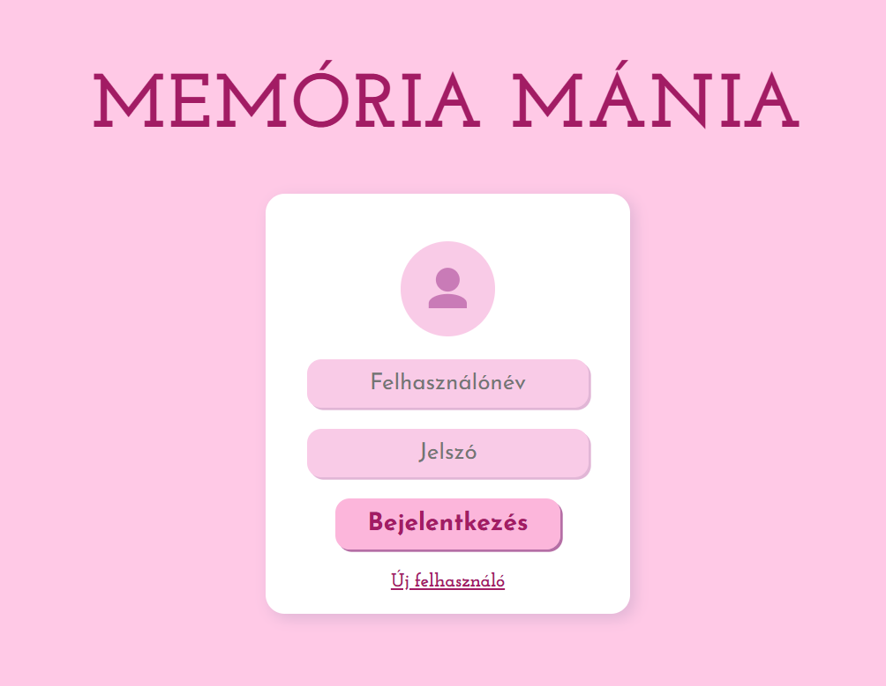
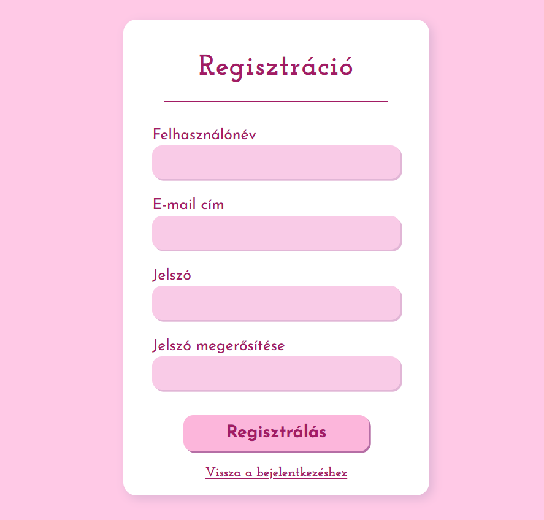
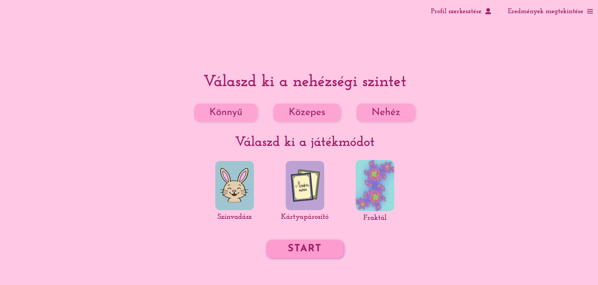
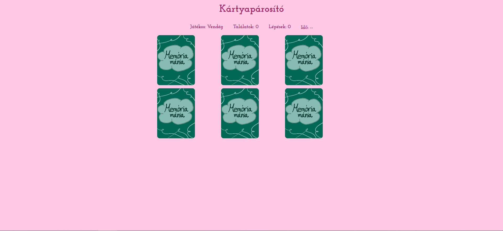
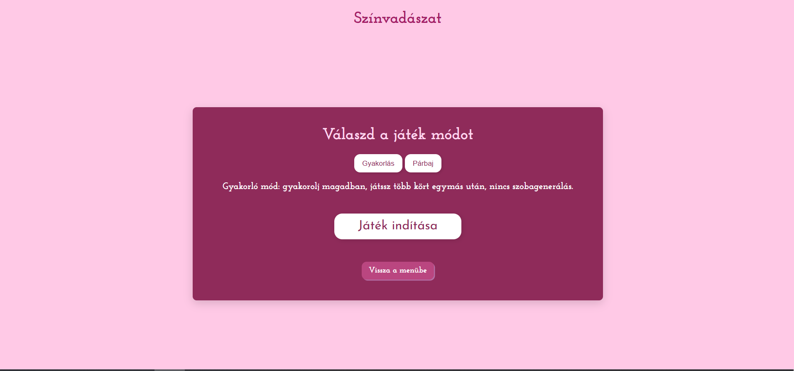
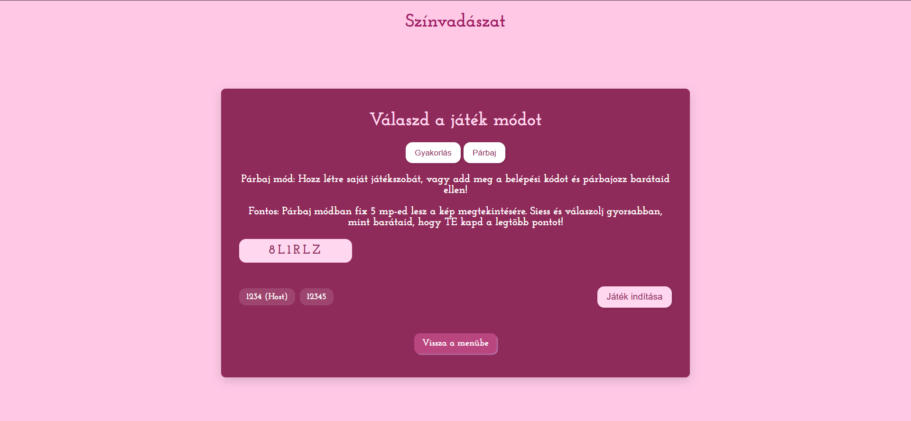
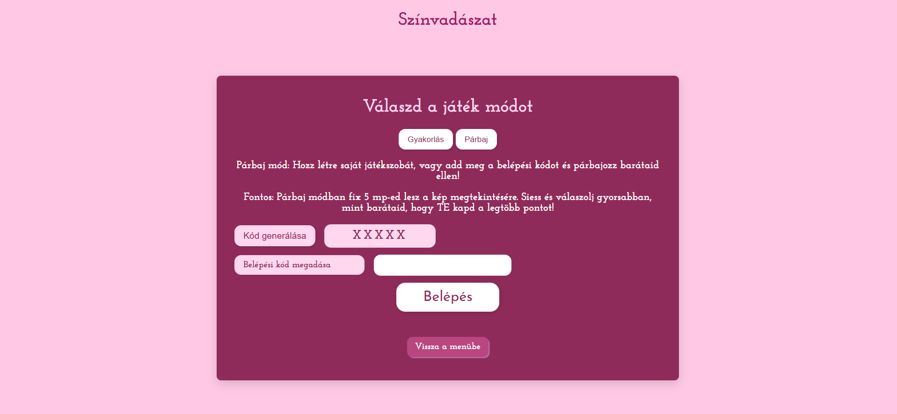
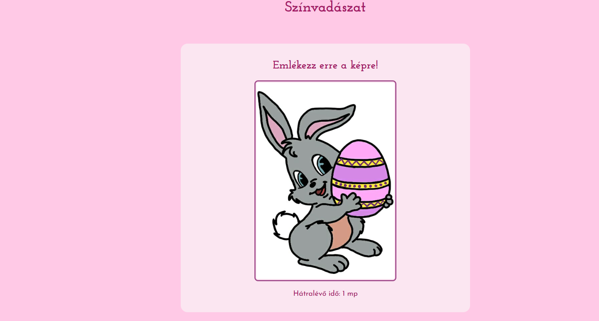
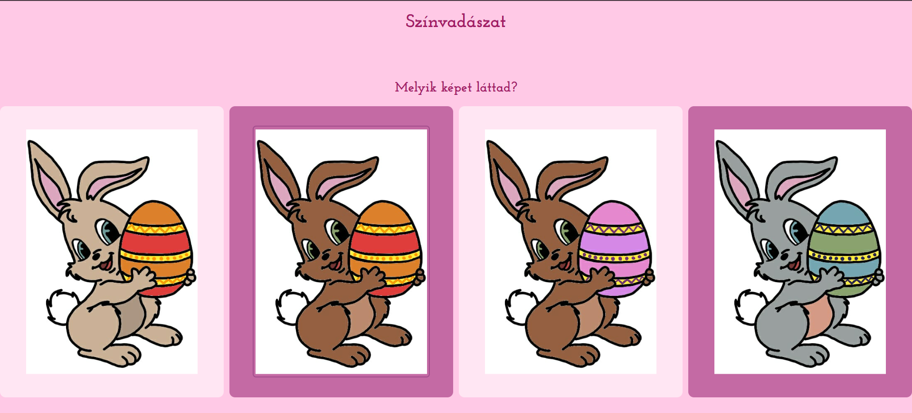
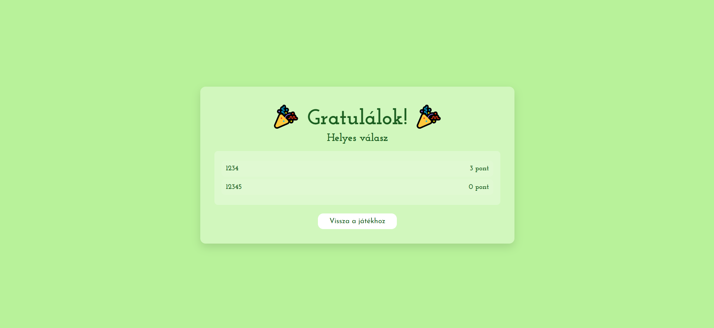
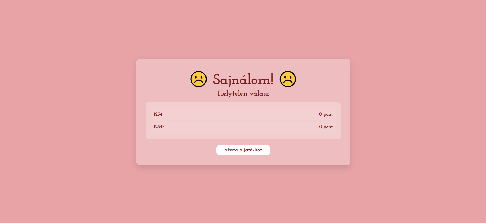
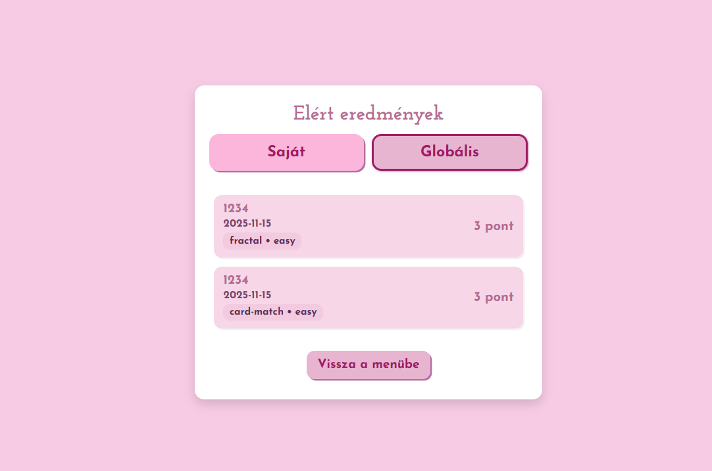
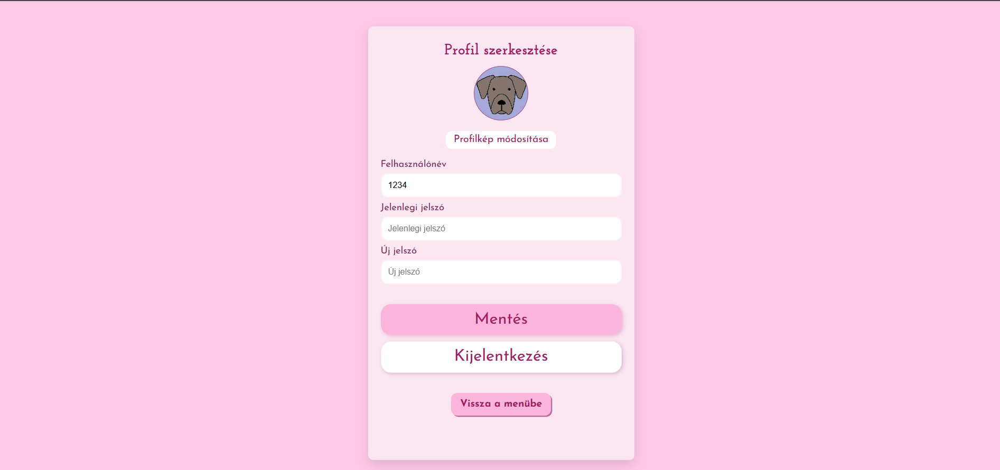

## 8. Forgatókönyv:
- Futási időben 3 fő szereplő figyelhető meg:
  - **Webalkalmazás** (Frontend) - Felhasználói felület
  - **Játékos** (Felhasználó) - A rendszer használója
  - **Web service** (Backend) - Adatkezelés és logika

### Alapvető folyamat:

1. **Regisztráció és bejelentkezés**: A játékos a webalkalmazáson keresztül regisztrálhat vagy bejelentkezhet. A web service validálja és tárolja a felhasználói adatokat.

2. **Játékmód választás**: Bejelentkezés után a játékos kiválaszthatja a kívánt játékmódot (Card Match, Color Hunter, Fraktál mód) és nehézségi szintet (Easy, Medium, Hard).

3. **Játékmenet**: A webalkalmazás biztosítja a játék felületét, ahol a játékos interakcióba léphet. A web service kezeli a játék logikát, pontszámokat és session-öket.

4. **Eredmények és ranglista**: A játék után a webalkalmazás megjeleníti a ranglistát, ahol a játékos láthatja statisztikáját. A web service tárolja és lekéri az eredményeket az adatbázisból.

### Multiplayer folyamat:

1. **Szoba létrehozás/csatlakozás**: A játékos létrehozhat szobát vagy csatlakozhat meglévőhöz 6 karakteres kóddal.

2. **Valós idejű játék**: A web service WebSocket kapcsolaton keresztül biztosítja a valós idejű kommunikációt. A webalkalmazás valós időben frissíti a játék állapotát és ranglistát.

3. **Játék vége**: A web service kezeli a pontszámokat, kieséseket és a végső ranglistát, amelyet a webalkalmazás megjelenít.

### Profilkezelés:

- A játékos a webalkalmazáson keresztül szerkesztheti profilját (felhasználónév, jelszó, profilkép). A web service validálja és tárolja a változtatásokat.

## 9. Fogalomszótár:

| Fogalom | Leírás |
| ------- | ------ |
| **Web-service** | Különböző programnyelveken írt és különböző platformokon futó szoftveralkalmazások interneten keresztül történő adatcseréjére használt vebszolgáltatások. |
| **Adatbázis** | Az adatbázis egy szervezett és strukturált módon tárolt adatgyűjtemény, amely lehetővé teszi az adatok hatékony kezelését, módosítását és lekérdezését. Az adatokat általában táblákba rendezve tárolják, ahol a mezők meghatározzák az adatok típusát és szerkezetét. Az adatbázis-kezelő rendszerek biztosítják az adatok biztonságos tárolását, integritásának megőrzését, valamint a gyors és egyidejű hozzáférést több felhasználó számára. |
| **Webalkalmazás** | Egy olyan szoftver, amelyet webböngészőn keresztül érünk el, és amely szerverekkel kommunikálva teljesít komplex feladatokat. A hagyományos weboldaktól eltérően interaktív funkciókat kínál – például adatokat dolgoz fel, tárol és jelenít meg – anélkül, hogy a felhasználónak telepítenie kellene. A legtöbb modern webalkalmazás háromrétegű architektúrán alapul: felhasználói felület (böngésző), backend logika (szerver) és adatbázis. |
| **Reszponzív design** | Olyan weboldal-tervezési módszer, amely automatikusan alkalmazkodik a különböző méretű kijelzőkhöz (asztali monitor, tablet, mobil), hogy optimális megjelenést és használhatóságot biztosíson minden eszközön. |
| **Adatintegritás** | Az adatok pontosságát, hiánytalanságát és konzisztenciáját biztosítja tárolás és feldolgozás során. |
| **Unit teszt** | A programkód legkisebb, önálló egységeinek (pl. függvények, metódusok) automatizált tesztelésére szolgálnak, hogy ellenőrizzük a megfelelő működésüket. |
| **Integrációs tesztek** | Azt ellenőrzik, hogy a rendszer különböző moduljai vagy komponensei helyesen együttműködnek-e. A unit tesztekkel ellentétben nem az egyes részek önálló működését, hanem azok közötti kapcsolatokat és adatcserét tesztelik. |
| **Multiplayer** | Többjátékos játékmenet, ahol több felhasználó egyidejűleg játszik egymás ellen vagy együtt ugyanabban a játékban. A rendszerben akár 6 játékos is részt vehet egy multiplayer szobában. |
| **WebSocket** | Valós idejű, kétirányú kommunikációs protokoll, amely lehetővé teszi a szerver és a kliens közötti folyamatos adatcserét. A multiplayer játékokban használjuk a valós idejű játékmenet biztosításához. |
| **Session** | Munkamenet, amely a felhasználó bejelentkezésétől a kijelentkezéséig tart. A session tárolja a felhasználó azonosításához szükséges információkat, és lehetővé teszi, hogy a rendszer nyomon kövesse a bejelentkezett felhasználó állapotát. |
| **Avatar/Profilkép** | A felhasználót reprezentáló grafikus kép vagy ikon, amely a profilján és a játékban jelenik meg. A rendszerben 9 előre feltöltött avatar közül választhatnak a felhasználók. |
| **Fraktál** | Önhasonló geometriai minta, amely részleteiben ismétlődik végtelenül. A rendszerben dinamikusan generált fraktál képeket használunk a vizuális megkülönböztető képesség fejlesztésére. |
| **Last man standing** | Játékmód mechanika, ahol a játékosok folyamatosan kiesnek, és az utolsó maradó játékos nyer. A multiplayer módban hibás válasz vagy leglassabb válaszadás esetén kiesnek a játékosok. |
| **Host** | A multiplayer szoba létrehozója, aki jogosult a játék indítására és a szoba kezelésére. Csak a host indíthatja el a multiplayer játékot. |
| **Scoreboard/Ranglista** | Eredménytáblázat, amely a játékosok pontszámait, statisztikáit és helyezéseit mutatja. A rendszerben globális és személyes ranglisták is elérhetők. |
| **Card Match** | Memóriakártya játék, ahol a játékosnak párokat kell találnia fordított kártyák közül. A rendszer egyik fő játékmódja. |
| **Color Hunter** | Kép alapján választás játék, ahol egy célképet kell megtalálni több lehetőség közül. A rendszer egyik fő játékmódja, amely multiplayer módban is játszható. |
| **Vendég játékos** | Regisztráció nélkül játszó felhasználó, aki ideiglenesen játszhat és statisztikákat gyűjthet, de nincs saját fiókja. |
| **API (Application Programming Interface)** | Alkalmazásprogramozási interfész, amely meghatározza, hogyan kommunikálhatnak egymással a különböző szoftverkomponensek. A rendszerben REST API-t használunk a frontend és backend közötti kommunikációhoz. |
| **REST API** | Representational State Transfer alapú API, amely HTTP protokollt használ a kérések és válaszok továbbításához. A rendszerben JSON formátumban cserél adatokat. |
| **Frontend** | A webalkalmazás felhasználói felületi rétege, amely a böngészőben fut, és biztosítja a felhasználóval való interakciót. HTML, CSS és JavaScript technológiákkal készül. |
| **Backend** | A webalkalmazás szerver oldali logikai rétege, amely feldolgozza a kéréseket, kezeli az üzleti logikát és az adatbázissal kommunikál. A rendszerben Python Flask keretrendszert használunk. |
| **E2E tesztek (End-to-End tesztek)** | Teljes felhasználói folyamatok automatizált tesztelése, amely a rendszer minden rétegét lefedi a felhasználói interakciótól az adatbázisig. A rendszerben Cypress keretrendszert használunk. |
| **Cypress** | Modern end-to-end tesztelési keretrendszer, amely lehetővé teszi a webalkalmazások automatikus tesztelését valós böngészőkben. |
| **SQL injection** | Biztonsági sebezhetőség, amikor rosszindulatú SQL kódot injektálnak be a lekérdezésekbe. A rendszerben paraméterezett lekérdezésekkel védjük ellene. |
| **XSS (Cross-Site Scripting)** | Biztonsági sebezhetőség, amikor rosszindulatú JavaScript kódot injektálnak be a weboldalba. A rendszerben különböző védekezési mechanizmusokkal védjük ellene. |
| **Hash** | Kriptográfiai hash függvény, amely egy adatot rögzített hosszúságú karakterlánccá alakít. A rendszerben a jelszavakat hash-elve tároljuk az adatbázisban biztonsági okokból. |
| **Health check** | Backend állapot ellenőrző végpont, amely információt ad a rendszer működési állapotáról, például az adatbázis kapcsolatról. |
| **Logolás** | Rendszeresemények, hibák és műveletek naplózása fájlokba, amely segít a hibakeresésben és a rendszer működésének nyomon követésében. |
| **Validáció** | Bejövő adatok ellenőrzése, hogy megfelelnek-e a várt formátumnak, típusnak és szabályoknak. A rendszerben mind a frontend, mind a backend oldalon validálunk. |
| **Kognitív képességek** | A megismerési folyamatokhoz kapcsolódó mentális képességek, mint a memória, a figyelem, a logikus gondolkodás és a problémamegoldás. |
| **Memória fejlesztés** | A rövid- és hosszú távú memória képességeinek fejlesztése különböző gyakorlatokkal és játékokkal. |
| **Mintafelismerés** | A képesség, hogy azonosítsuk és felismerjük a mintákat, mintákat és struktúrákat a vizuális információban. |
| **Vizuális megkülönböztető képesség** | A képesség, hogy finom vizuális különbségeket észleljünk és megkülönböztessünk egymástól hasonló objektumokat vagy mintákat. |
| **Koncentráció** | A figyelem összpontosítása egy adott feladatra vagy ingerre hosszabb ideig. |
| **Reakcióidő** | Az idő, amely eltelik egy inger észlelése és a rá adott válasz között. |
| **Finom motorika** | A kis izmok finom, precíz mozgásainak koordinálása, például az ujjak mozgatása. |
| **Szociális interakció** | Az emberek közötti kommunikáció és együttműködés, amely a multiplayer játékokban fontos szerepet játszik. |
| **Verseny szellem** | A versenyzés és a teljesítmény javítására való motiváció, amely a ranglisták és multiplayer játékok révén alakul ki. |
| **Pontszám** | A játékban elért eredmény, amely a játékos teljesítményét méri. A rendszerben minden játék után pontszámot rögzítünk. |
| **Statisztika** | A játékosok teljesítményére vonatkozó adatok gyűjtése és elemzése, mint a játszott játékok száma, legjobb pontszám, átlagos játékidő. |
| **Szoba (multiplayer)** | Virtuális tér a multiplayer játékokhoz, ahol a játékosok összegyűlnek és játszanak. Minden szobának van egy egyedi 6 karakteres kódja. |
| **Szoba kód** | Egyedi azonosító, amely lehetővé teszi, hogy a játékosok csatlakozzanak egy meghatározott multiplayer szobához. |
| **Körönkénti játékmenet** | Olyan játékmenet, amely több körből áll, ahol minden körben új feladatot kell megoldani. A multiplayer módban körönként pontokat osztanak. |
| **Valós idejű kommunikáció** | Azonnali adatcsere a szerver és a kliens között, amely lehetővé teszi, hogy a változások azonnal láthatóak legyenek minden résztvevő számára. |
| **Játékmenet** | A játék folyamata, amely magában foglalja a játékos interakcióit, a játék logikáját és az eredmények kiszámítását. |
| **Játékállapot** | A játék pillanatnyi állapota, amely tartalmazza a játékos pozícióját, pontszámát, a játék fázisát és egyéb releváns információkat. |
| **Lépésszámolás** | A játékban tett lépések vagy akciók számának nyomon követése. A Card Match játékban a fordított kártyák számát számoljuk. |
| **Játékidő mérés** | A játék kezdete és vége közötti idő mérése, amely a teljesítmény értékelésének része. |
| **Körök számlálása** | A játszott körök számának nyomon követése, különösen a Color Hunter játékban. |
| **Lapozás (Pagination)** | Nagy adathalmazok esetén az adatok oldalakra bontása, hogy könnyebben böngészhetők legyenek. A ranglistáknál használjuk. |
| **Szűrés** | Adatok kiválasztása meghatározott feltételek alapján. A ranglistáknál játékmód és nehézségi szint szerint szűrhetünk. |
| **Rendezés** | Adatok sorrendbe állítása meghatározott kritérium szerint (pl. pontszám, idő, dátum). A ranglistáknál több rendezési lehetőség is elérhető. |
| **Globális ranglista** | Az összes játékos legjobb eredményeit tartalmazó ranglista, amely lehetővé teszi a játékosok összehasonlítását. |
| **Saját eredmények** | A bejelentkezett felhasználó saját játékeredményeinek listája, amely személyes statisztikákat tartalmaz. |
| **Játékos statisztikák** | Egy játékos teljesítményére vonatkozó összesített adatok, mint a játszott játékok száma, legjobb pontszám, utolsó játék időpontja. |
| **Automatikus inicializálás** | Az adatbázis és táblák automatikus létrehozása az első indításkor, ha még nem léteznek. |
| **Adatbázis karbantartás** | Az adatbázis rendszeres karbantartása, mint a régi adatok törlése, optimalizálás. A multiplayer szobák automatikusan törlődnek inaktivitás után. |
| **Felhasználókezelés** | A felhasználói fiókok létrehozása, módosítása, törlése és kezelése. |
| **Autentikáció** | A felhasználó azonosítása és hitelesítése, általában felhasználónév és jelszó megadásával. |
| **Jelszó titkosítás** | A jelszavak biztonságos tárolása hash algoritmusokkal, hogy ne lehessen visszafejteni az eredeti jelszót. |
| **Profil szerkesztés** | A felhasználói profil adatainak (felhasználónév, jelszó, profilkép) módosítása. |
| **Profilkép választás** | A felhasználó által választott avatar vagy kép, amely a profilján jelenik meg. |
| **Vendég mód** | Regisztráció nélküli játéklehetőség, ahol a felhasználó ideiglenesen játszhat, de nincs saját fiókja. |
| **Játékmód választás** | A játékos által választott játék típusa (Card Match, Color Hunter, Fraktál mód). |
| **Nehézségi szintek** | A játék nehézségi fokozatai (Easy, Medium, Hard), amelyek különböző paramétereket határoznak meg, mint a párok száma vagy az időkorlát. |
| **Memóriakártya** | Párosító kártyajáték, ahol a játékosnak fordított kártyák közül párokat kell találnia. |
| **Kép alapján választás** | Olyan játékmechanika, ahol egy célképet kell megtalálni több lehetőség közül. |
| **Dinamikus generálás** | Folyamatosan változó, előre nem meghatározott tartalom létrehozása. A fraktál módban dinamikusan generált képeket használunk. |
| **Absztrakt minták** | Nem konkrét, ismert objektumokat ábrázoló, hanem geometriai vagy formai mintákat tartalmazó képek. |
| **Vizuális ingerek** | Látási érzékelésen alapuló információ, amely a játékban fontos szerepet játszik. |
| **Figyelmi terhelés** | A koncentráció és figyelem összpontosításához szükséges mentális erőfeszítés. |
| **Tartós fókusz** | Hosszabb ideig tartó, folyamatos figyelem összpontosítása egy feladatra. |
| **Csoportos fejlesztés** | Több személy együttes részvételével történő fejlesztési folyamat, ahol a közös élmény és verseny motiváló tényező. |
| **Motiváció** | A belső vagy külső hajtóerő, amely mozgásba hozza a játékost a játékban való részvételre. |
| **Játékélmény** | A játékos által tapasztalt összesség, amely magában foglalja a szórakozást, kihívást és elégedettséget. |
| **Admin szerepkör** | Rendszergazdai jogosultságokkal rendelkező felhasználói szerepkör, amely lehetővé teszi a rendszer teljes kezelését. |
| **Játékos szerepkör** | Alapvető felhasználói szerepkör, amely lehetővé teszi a játékok játszását és a profil kezelését. |
| **Multiplayer játékos szerepkör** | Többjátékos módban játszó felhasználó szerepköre, amely lehetővé teszi a szobák létrehozását és csatlakozását. |
| **Adminisztrációs jogosultság** | Rendszergazdai hozzáférési jogok, amelyek lehetővé teszik a felhasználók, játékok és rendszerbeállítások kezelését. |
| **Rendszerstatisztika** | A rendszer működésére vonatkozó adatok, mint az aktív felhasználók száma, legnépszerűbb játékmódok, átlagos játékidők. |
| **Teljesítmény monitorizálás** | A rendszer teljesítményének folyamatos nyomon követése, hogy azonosítsuk a problémás területeket. |
| **Rendszer napló** | A rendszer működésére, hibáira és eseményeire vonatkozó rögzített információk, amelyek segítik a hibakeresést és a rendszer karbantartását. |
| **Háromrétegű architektúra** | Szoftverarchitektúra, amely három rétegre oszlik: felhasználói felület (presentation layer), üzleti logika (business logic layer) és adatbázis (data layer). |
| **Böngésző** | Webböngésző, amely lehetővé teszi a webalkalmazások elérését és megjelenítését. |
| **Szerver** | Olyan számítógép vagy szoftver, amely szolgáltatásokat nyújt más számítógépeknek vagy alkalmazásoknak a hálózaton keresztül. |
| **Felhasználói felület (UI)** | A rendszer azon része, amely a felhasználóval közvetlenül interakcióba lép, és lehetővé teszi a rendszer használatát. |
| **Adatkezelés** | Az adatok feldolgozása, tárolása, lekérése és módosítása. |
| **Logika** | Az üzleti szabályok és algoritmusok, amelyek meghatározzák, hogyan működik a rendszer. |
| **Regisztráció** | Új felhasználói fiók létrehozása a rendszerben, amelyhez általában email cím, felhasználónév és jelszó szükséges. |
| **Bejelentkezés** | A felhasználó azonosítása a rendszerben felhasználónév és jelszó megadásával. |
| **Kijelentkezés** | A bejelentkezett felhasználó munkamenetének befejezése és a rendszerből való kilépés. |
| **Szoba létrehozás** | Új multiplayer szoba létrehozása, amelyhez egyedi kódot generál a rendszer. |
| **Szobához csatlakozás** | Meglévő multiplayer szobához való csatlakozás egyedi kód megadásával. |
| **Valós idejű játék** | Olyan játékmenet, ahol a játékosok egyidejűleg játszanak, és a változások azonnal láthatóak minden résztvevő számára. |
| **WebSocket kapcsolat** | Valós idejű, kétirányú kommunikációs csatorna a szerver és a kliens között, amely lehetővé teszi az azonnali adatcserét. |
| **Játék vége** | A játék befejezése, amikor minden kör lejátszódott vagy a játékosok kiestek. |
| **Pontszámok** | A játékban elért eredmények, amelyek a játékos teljesítményét méri. |
| **Kiesések** | A játékosok kizárása a játékból, amely a multiplayer módban hibás válasz vagy leglassabb válaszadás esetén történik. |
| **Végső ranglista** | A játék végén megjelenő ranglista, amely a végső pontszámokat és helyezéseket mutatja. |
| **Validálás** | Bejövő adatok ellenőrzése, hogy megfelelnek-e a várt formátumnak és szabályoknak. |
| **Tárolás** | Az adatok mentése az adatbázisba vagy más tárolórendszerbe. |
