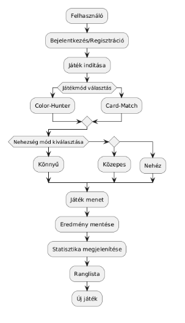
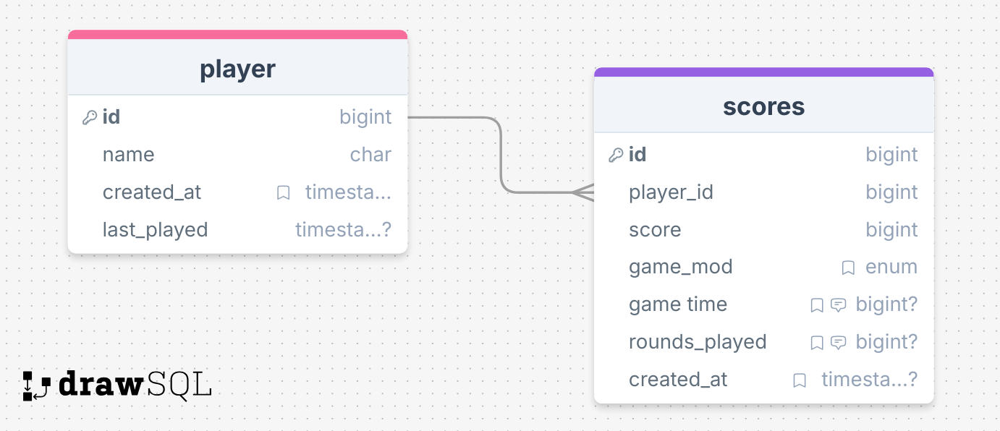

# Rendszerterv

1. ## A rendszer célja:

   A webalkalmazás célja hogy a felhasználó egy memóriakátékot játszon és fejlessze a memóriáját. Felhasználó képes 3 nehézségi szint közül választani. Felhasználónak van lehetősége nevet választani és később az elért pontokat is láthatja a játék után. Fontos, hogy a felhasználó könnyen el tudjon igazodni a felületeken ezért minimalista felhasználói felületet kap a program.
   Minden elért eredményt adatbázisban tárol a program így visszatudja keresni az előző eredményeket. A rendszer kizárólag webes környezetben lesz használható. Top listán fog megjeleni a felhasználó eremédnye.

2. ## Projekterv

   **Projektszerepkörök, felelőségek:**

   - Scrum master: Tassi Bence
   - Product owner: Fónád Bálint
     **Projektmunkások és felelőségek:**
   - Backend és Teszt: Tassi Bence, Feladata az adatok tárolásához szükséges adatszerkezetek kialakítása,
     funkciók létrehozása, a különböző platformok kiszolgálása adatokkal, adatbázis és a frontend elemek összekapcsolása. Teszt oldalon minden funkciójának ellenőrzése, hibák felderítése és dokumentálása. Teszteli a kártyafordítás működését, a párosítási logikát, az időzítő pontos működését, az adatbázis-mentést és a különböző böngészőkben való megfelelő működést. Jelenti a talált hibákat és segít a minőségbiztosításban.

   - Frontend: Fónad Bálint és Spišáková Antónia, weboldal vagy alkalmazás felhasználói felületének (UI) és felhasználói élményének (UX) kialakításáért és megvalósításáért felelős.Dizájnok kódolása, interaktív elemek létrehozása, valamint annak biztosítása, hogy a felület gyors, stabil és intuitív legyen.

   - Design: Spišáková Antónia, esztétikus és felhasználóbarát megjelenésének kialakítása. Ez magában foglalja a színpaletta, tipográfia és vizuális stílus meghatározását, a kártyák és felületi elemek designját, valamint az animációk és átmenetek tervezését. A designer felelős azért, hogy a játék reszponzív legyen minden eszközön, és hogy intuitív felhasználói élményt nyújtson a játékosoknak.

   **Űtemterv:**
   | Funkció | Feladat | Prioritás | Becslés | Aktuális idő | Eltelt idő| Hátralévő idő |
   |-----------|-----------|---|----|----|------|-------|
   Követelmény specifikáció| | 1 | 4 | 4| 4| 0|
   Rendszerterv| | 1 | 3 | 3 | 2 | 1|
   Use-case modell | | 1 | 1 | 1 | 1| 0|
   Adatbázis modell| | 1 | 1 | 1 | 1| 0|
   Adattárolás | Adatmodel megtervezése | 2 | 1 | 1 | 1 | 0|
   | |Adatbázis megvalósítása a szerveren | 2 | 3 | 3 | 0 | 3|
   Frontend | Frontend megtervezése | 2 | 4 | 4 | 3 | 1|
   | | Frontend implementálás | 2 | 10 | 10 | 6 | 4|
   Design | Design megtervezése | 2 | 5 | 5 | 4 | 1|
   || Design implementálás | 2 | 3 | 3 | 2 | 1|
   || UI megtervezése | 2 | 2 | 2 | 1 | 1|
   Backend | Backend megtervezése | 2 | 10 | 10 | 3 | 7|
   || Backend implementálása | 2 | 15 | 15 | 2 | 13|

   **Mérföldkövek:**

   - Előírt modellek és dokumentumok elkészítése.
   - Adatmodell elkészítése megtörtént bemutatásra vár.

3. ## Üzleti folyamatok modellje:

   

4. ## Követelmények:

- Funkcionális követelmények:
  - Felhasználó adatainak tárolása
  - Webes környezteben müködik az alkalmazás.
  - Felhasználóknak adatai listázása.
  - Felhasználónak lehetőséget adni több nehezségi szint közül választani.
  - Adatvalidáció megoldása
  - Reszponzívitás megoldása
  - Átlátható kódstruktúrai megoldás
  - Eseménykezelés megoldása
  - Vizuális megoldás az interakciókról
- Nem funkcionális követelmények:
  - A felhasználó képes fejleszteni a saját memóriáját és ezzel pontokat szerezhet.
  - Különböző szintek és játékmódok közül választhat a felhasználó igényei szerint.
  - Felhasználók top lista szerűen hasonlíthatják egymás eredményeit a sajátjaikhoz, verseny szellem kialakulása.

5. ## Funkcionális terv

   **Rendszerszereplők:**
   Admin
   Játékos
   **Rendszerhasználati esetek és lefutásaik:**
   Admin:

   - A felhasználói adatokat látják, változtathatják
   - Felhasználó hozzáadására, törlésére van lehetőségük
   - Plusz nehézségi szintek létrehozzása
   - Játékeseteket átlátja
     Játékos:
   - Játékmódok választása
   - Program használata
   - Látja a toplistát de nem tudja módosítani
   - Ereményért pontokat kapnak egy pontozási rendszer szerint
     **Menü-hierarchiák:**

6. ## Fizikai környezet
   - Az alkalmazás csak webes platformra készül.
   - Backend valósítsa meg a frontend és adatbázis kapcsolatot.
   - Nincsenek megvásárolt komponenseink.
   - Fejlesztői eszközök:
     - Visual Studio Code
     - Pycharm
     - Flask Framework
     - Pytest
     - Mysql Workbench
7. ## Architekturális terv

   - Backend: A rendszerhez Mysql adatbázis szervert használunk.A kliens oldali programokat egy python alapú REST api szolgálja ki, ez csatlakozik az adatbázis szerverhez.A kliens weboldal szerver adatokkal kommunikál.
   - Web kliens: A web alkalmazás CSS, HTML és Javascript használatával készül el.User név adás után rest api, api-keyek segítségével ad hozzáférést a játékhoz és adatokhoz.Ez biztosítja, hogy illetéktelen felhasználók ne módosíthassák az adatokat

8. ## Adatbázis terv:

   

9. ## Implementációs terv:

   - Web: A Webes felület főként HTML, CSS, és Javascript nyelven fog készülni. Ezeket a technológiákat amennyire csak lehet külön fájlokba írva készítjük, és úgy fogjuk egymáshoz csatolni a jobb átláthatóság, könnyebb változtathatóság, és könnyebb bővítés érdekében. Képes lesz felhasználni a Backend részen futó REST szolgáltatás metódusait, ezáltal tud felvinni és lekérdezni adatokat az adatbázisból. Flask keretrendszert használunk a backend megvalósításához hogy könnyen meg tudjuk valósítani a kommunikációt a MySql szerver és Kliens között. MySql adatbázisban két relációs táblát fogunk megvalósítani. Amiben egy egyedi kulcs fogja azonosítani magát a játékost. Player táblában fogjuk tárolni a nevét a játékosnak és a scores táblában pedig a játékos pontjait és a játék idejét. Az eltelt időt a kliens fogja számolni a feladatoknál, hogy ne legyenek eltérések.

10. ## Tesztterv:
    A tesztelések célja a rendszer és komponensei funkcionalitásának teljes vizsgálata, ellenőrzése, a rendszer által megvalósított üzleti szolgáltatások verifikálása.

- **Unit tesztek:**
  A fejlesztési folyamat során folyamatosan kell tesztelni a metódusok funkcionalitását. Minden metódushoz Unit teszteket kell írni, amelyekkel elérjük a minél nagyobb kódlefedettséget. Egy metódus akkor tekinthető késznek, ha a hozzá tartozó tesztesetek hiba nélkül lefutnak.
- **Tesztelendő funkciók:**

  **Játék logikája:**
  Szükséges a játék mindkettő funkcióját tesztelni, ugyanis az egyik játékmód az idő alapú nem e fut túl az időn a játékos ha igen akkor át kell lépnie a scoreboardra.Játék módok esetén a pont a játék mód nehézsége is meghatározza. A leggyengébb játékmód az időalapú ott score adattagot nehézség határozza meg és a találat száma. A párosítás alapú játékmódnál a találatok száma és a játékmód nehézsége határozza meg. Ezeket szűkséges tesztelni.

  **Scoreboard**:
  Adatbázis oldalról megfelelően jelenti meg a neveket és a scoreokat. Ezt backend oldaról kapcsolatokat teszteljük.
  Fel kell tudnia tölteni, és le kell tudnia kérdezni az adatbázis adatait amit backend oldalról teszteljük. Frontend oldalról adatokat megfelelően kell tudnia a backend felé amit backend feldolgoz és adatbázis szerveren tárol így jön létre a kommunikáció. Kommunikációt szükséges tesztelnünk hogy megfelelően felépüljön. Adatintegritást, -validációt kell tesztelnünk.

  **Kártya fordtása:**
  Frontend oldalról szükséges tesztelni az animációkat ezt esztétikus implementációt követel meg. Magát a funkciót szükséges implementálás után tesztelni. Ez alapján score változó számolódik így fontos a funkció megfelelő müködése. A kártyának két oldala van így a visszafordulását is figyelni kell hogy jó e az adott kártya párja.
