# Rendszerterv

1. ## A rendszer célja:

   - A webalkalmazás célja hogy a felhasználó egy memóriajátékot játszon és fejlessze a memóriáját. Felhasználó képes 3 nehézségi szint közül választani 4 játékmód közül (Card Match, Color Hunter, Fraktál mód, és Color Hunter Multiplayer). Felhasználónak van lehetősége nevet választani és később az elért pontokat is láthatja a játék után. Fontos, hogy a felhasználó könnyen el tudjon igazodni a felületeken ezért minimalista felhasználói felületet kap a program.
   Minden elért eredményt adatbázisban tárol a program így visszatudja keresni az előző eredményeket. A rendszer kizárólag webes környezetben lesz használható. Top listán fog megjeleni a felhasználók eredménye. A webalkalmazás belépési pontja egy belépési felületre mutat így belépés után fog tudni játszani a felhasználó a játékkal. Van arra is lehetősége a felhasználók hogy vendégként lépjen be viszont abban az esetben ideiglenesen tárolódnak az adatok. 
   
   - A rendszer támogatja a valós idejű multiplayer játékmenetet is, ahol akár 6 játékos is egyidejűleg versenyezhet egymás ellen. A multiplayer módban a játékosok szobákba csatlakozhatnak egyedi kóddal, és versenyezhetnek last man standing mechanikával. Ez a funkció tovább erősíti a verseny szellemét és lehetővé teszi, hogy a játékosok közvetlenül összemérjék képességeiket másokkal.
   
   - A fő felhasználó bázis célunk igazából a teljes korosztály viszont szeretnénk szakembereknek is segítséget nyújtani a gyermekek fejlesztésében.

2. ## Projekterv

   **Projektszerepkörök, felelőségek:**

   - Scrum master: Tassi Bence
   - Product owner: Fónád Bálint

     - **Projektmunkások és felelőségek:**

     - Backend és Teszt: Tassi Bence, feladata az adatok tárolásához szükséges adatszerkezetek kialakítása,funkciók létrehozása, a különböző platformok kiszolgálása adatokkal, adatbázis és a frontend elemek összekapcsolása.Felelőse a bejelentkezési és regisztráció funkció megfelelő validálásáert illetve adatbázisban való biztonságos tárolásért. Authentikációs és validálási metódusok kidogozásáért felelős. 
     Teszt oldalon minden funkciójának ellenőrzése, hibák felderítése és dokumentálása. Teszteli a kártyafordítás működését, a párosítási logikát, az időzítő pontos működését, az adatbázis-mentést és a különböző böngészőkben való megfelelő működést. Jelenti a talált hibákat és segít a minőségbiztosításban.

     - Frontend: Fónad Bálint és Spišáková Antónia, weboldal vagy alkalmazás felhasználói felületének (UI) és felhasználói élményének (UX) kialakításáért és megvalósításáért felelős. Dizájnok kódolása, interaktív elemek létrehozása, valamint annak biztosítása, hogy a felület gyors, stabil és intuitív legyen. Animációk minél folyékonyabb megjelenéséért és minél esztétikusabb kidolgozásáért. A frontendadatok megfelelő formátumú adat küldésért a backend felé.

     - Design: Spišáková Antónia, esztétikus és felhasználóbarát megjelenésének kialakítása. Ez magában foglalja a színpaletta, tipográfia és vizuális stílus meghatározását, a kártyák és felületi elemek designját, valamint az animációk és átmenetek tervezését. A designer felelős azért, hogy a játék reszponzív legyen minden eszközön, és hogy intuitív felhasználói élményt nyújtson a játékosoknak.

   **Űtemterv:**
   | Funkció | Feladat | Prioritás | Becslés | Aktuális idő | Eltelt idő| Hátralévő idő |
   |-----------|-----------|---|----|----|------|-------|
   Dokumentáció|Követelmény specifikáció| 1 | 4 | 6| 5| 1|
   ||Rendszerterv| 1 | 3 | 8 | 7 | 1|
   ||Funkcionális specifikáció| 1 | 2 | 4 | 4 | 0|
   ||Use-case modell | 1 | 1 | 2 | 2| 0|
   ||Adatbázis modell | 2 | 2 | 5 | 4| 0|
   ||User-storyk írása | 2 | 2 | 3 | 2| 0|
   Adattárolás | Adatmodel megtervezése | 3 | 1 | 4 | 3 | 0|
   | |Adatbázis megvalósítása a szerveren | 3 | 1 | 4 | 3 | 0|
   Frontend | Frontend megtervezése | 2 | 4 | 10 | 8 | 2|
   || Frontend implementálás | 2 | 20 | 40 | 30 | 10|
   || Fő oldal elkészítése | 3 | 2 | 4 | 4 | 0|
   || Gombok kiszolgálása script fájlokkal és útvonalválasztás frontend megvalósítása | 3 | 3 | 6 | 6 | 0|
   ||  Játék választós oldal létrehozása | 3 | 2 | 3 | 3 | 0|
   ||  Két játék mód megvalósítása struktúrába szervezve | 3 | 5 | 7 | 7 | 0|
   ||  Login és registration design-ok refaktorálása | 2 | 2 | 3 | 3 | 0|
   ||  Login képernyő prototípus | 3 | 4 | 6 |6 | 0|
   ||  Login összekötése a backenddel | 3 | 3 | 5 |5 | 0|
   ||  Oldalak kiszolgálása CSS fájlokkal | 2 | 8 | 9 |9 | 0|
   ||  POST metódusokkal való adatok átadása backend, adatbázis felé | 3 | 2 | 3 |3 | 0|
   ||  Scoreboard a menü oldalon | 3 | 2 | 4 |4 | 0|
   ||  Scoreboard oldal megvalósítása és scriptel való támogatása | 3 | 4 | 5 |5 | 0|
   ||  Kód refaktorálás | 2 | 6 | 6 |6 | 0|
   ||  Fraktál párosító megvalósítása | 3 | 7 | 6 |6 | 1|
   ||  Játék design megvalósítása figma alapján| 2 | 4 | 3 | 2 | 1|
   ||  Logout megvalósítása| 3 | 3 | 4 | 4 | 0|
   ||  Avatar oldal megvalósítása | 2 | 4 | 1 | 1 | 3|
   || Multiplayer UI | 3 | 6 | 8 | 7 | 1|
   || WebSocket kliens integráció | 3 | 4 | 5 | 5 | 0|
   Design | Design megtervezése | 2 | 5 | 10 | 9 | 1|
   || Design implementálás Figmában | 2 | 3 | 15 | 13 | 2|
   || Login/register UI | 2 | 2 | 3 | 3 | 0|
   || Hátterek kialakítása | 2 | 2 | 2 | 2 | 0|
   || Kártyák megvalósítása | 2 | 8 | 8 | 8 | 0|
   || Profiladat figma módosítása | 1 | 3 | 0 | 0 | 3|
   Backend | Backend megtervezése | 2 | 10 | 10 | 10 | 0|
   || Backend implementálása | 2 | 50 | 50 | 30 | 20 |
   ||  .env fájl kialakítása környezeti változókhoz | 3 | 2 | 2 | 2 | 0|
   ||  Adatbázis megvalósítása | 3 | 3 | 4 | 4 | 0|
   ||  Adatbázisba való adatok átadása és a frontend back end kapcsolat létrehozása | 3 | 4 | 5 | 5 | 0|
   ||  API vépontok kialakítása | 3 | 4 | 6 | 6 | 0|
   ||  Authetikációs és validációs metódusok megvalósítása | 3 | 8 | 10 | 10 | 0|
   ||   Hibák és adatok logolásának megvalósítása | 3 | 4 | 5 | 5 | 0|
   ||   Megfelelő kód dokumentáció kialakítása és errorok magyarázatos kialakítása | 2 | 3 | 4 | 4 | 0|
   ||   Profil adatok módosítására szükséges backend metódusok megvalósítása | 3 | 4 | 5 | 5 | 0|
   ||   Regisztráció és login endpoint a login funkcióhoz | 3 | 6 | 7 | 7 | 0|
   ||   Scoreboard kiszolgálása | 3 | 5 | 6 | 6 | 0|
   ||   Kód refaktorálás | 2 | 10 | 8 | 6 | 2|
   || Multiplayer API végpontok | 3 | 6 | 8 | 7 | 1|
   || SocketIO implementáció | 3 | 8 | 10 | 9 | 1|
   || Multiplayer játék logika | 3 | 10 | 12 | 11 | 1|
   Teszt | Teszt megtervezése | 2 | 15 | 12 | 12 | 3|
   ||   Backend unit tesztek | 3 | 10 | 8 | 6 | 2|
   ||   Backend integration tesztek | 3 | 8 | 6 | 6 | 0|
   ||   E2E tesztek | 3 | 4 | 3 | 3 | 1|
   ||   Cypress tesztek | 2 | 3 | 2 | 2 | 1|
   || Multiplayer tesztek | 3 | 6 | 5 | 4 | 1|

   **Mérföldkövek:**

   - 🔄  Előírt modellek és dokumentumok elkészítése.
   - ✅  Adatmodell elkészítése megtörtént bemutatásra vár.
   - ✅  Frontend implementáció nagy részt elkészült átadásra vár.
   - ✅  Backend implementáció elkészült átadásra.
   - ✅  Program közel teljes designja és UI-ja elkészült bemutatásra vár.
   - ✅  Frontend POST metódusok elkészítése (api.js postJSON függvény).
   - ✅  A projekt demója elkészült bemutatásra vár.
   - ✅  Login backend elkészítése
   - ✅  Login frontend elkészítése
   - ✅  Teljes UI design kialaktása
   - ✅ Alap két játék mód átadva, müködik.
   - ✅ Fraktál játékmód alapfunkciói elkészültek (score mentés, UI integráció)
   - ✅  Kártyák elkészítése új játékmódokhoz
   - ✅  Avatar választó felület és funkció teljes megvalósítása.
   - ✅  Profil szerkesztés oldal frontend megvalósítása (backend API kész: /api/user/update).
   - ✅  Eredmények/scores oldal frontend megvalósítása (backend API kész: /api/scores, route: /scores).
   - ✅  Tesztek elkészítése (Cypress E2E tesztek elkészültek, unit/integration tesztek ellenőrzésre várnak).
   - ✅ Multiplayer API végpontok elkészültek
   - ✅ SocketIO integráció elkészült
   - ✅ Multiplayer játék logika implementálva
   - ✅ Multiplayer UI finomhangolása
   - 🔄  Játék teljes bemutatása (fő funkciók működnek, finomhangolás folyamatban).

3. ## Üzleti folyamatok modellje:

   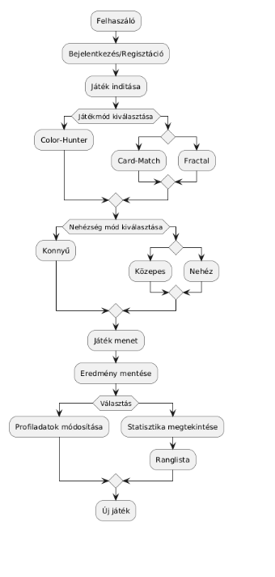

4. ## Követelmények:

- Funkcionális követelmények:
  - Felhasználó adatainak tárolása.
  - Webes környezteben müködik az alkalmazás.
  - Felhasználóknak adatai listázása.
  - Felhasználónak lehetőséget adni több nehezségi szint közül választani.
  - Adatvalidáció megoldása.
  - Reszponzívitás megoldása.
  - Átlátható kódstruktúrai megoldás.
  - Eseménykezelés megoldása.
  - Vizuális megoldás az interakciókról.
  - Bejelentkezési és regisztációs felület kialakítása.
  - Felhasználói adatok módosítására szolgáló felület kidolgozása.
  - Adatbázisba való bejelentkezési és regisztrációs adatok tárolása.
  - Avatar választó felület megoldása.
  - Avatar adatbázisba való tárolás megoldása.
  - Validációs és autentikációs metódusok megoldása backendben.

- Nem funkcionális követelmények:
  - A felhasználó képes fejleszteni a saját memóriáját és ezzel pontokat szerezhet.
  - Különböző szintek és játékmódok közül választhat a felhasználó igényei szerint.
  - Felhasználók top lista szerűen hasonlíthatják egymás eredményeit a sajátjaikhoz, verseny szellem kialakulása.
  - Játékos létrehozhat fiókot és saját igényei szerint módosíthaja az avatárját, jelszavát és felhasználónevét.

5. ## Funkcionális terv

   **Rendszerszereplők:**

   - Admin
   - Játékos

     - **Rendszerhasználati esetek és lefutásaik:**

     - Admin:

       - A felhasználói adatokat láthatja, változtathatja
       - Szerkesztheti vagy törölheti a felhasználói fiókokat
       - Módosíthatja a játékosok neveit, statisztikáit
       - Plusz nehézségi szintek létrehozzása
       - Játékeseteket átlátja
       - Láthatja az összes játék eredményét
       - Ellenőrizheti és kezelheti a ranglistát
       - Módosíthatja a pontszámítási algoritmust
       - Aktív felhasználók számának nyomon követése
       - Legnépszerűbb játékmódok elemzése
       - Átlagos játékidők és pontszámok megtekintése
       - Problémás játékterületek felderítése
       - Adatbázis karbantartás
       - Rendszer naplók megtekintése
       - Adatvédelem biztosítása
       - Teszt játékok indítása
       - Játékmechanikák tesztelése különböző konfigurációkban
       - Problémás helyzetek kezelése

     - Játékos:
       - Játékmódok választása
       - Program használata
       - Látja a toplistát de nem tudja módosítani
       - Ereményért pontokat kapnak egy pontozási rendszer szerint
       - Saját profil létrehozása
       - Személyes statisztikák mentése
       - Adatvédelmi garancia
       - Vendég játékos profil létrehozása
       - Vendég játékos esetén ideiglenes eredménymentés
       - Nehézségi szint beállítása
       - Legjobb pontszámod megtekintése
       - Utolsó játékod ideje
       - Jelszó védelme csak te férhetsz hozzá a fiókodhoz
       - Jogod van a törléshez - bármikor kérheted adataid törlését

    - **Menü-hierarchiák:**
      - BEJELENTKEZÉS
        - Bejelentkezés
      - REGISZTRÁCIÓ
        - Regisztráció
      - MAIN MENÜ
      - PROFIL SZERKESZTÉS
        - Profil szerkesztés
        - Avatar választó
      - EREDMÉNY MEGTEKINTÉSE
        - Saját scoreboard
        - Globális scoreboard
        - Nehézség kiválasztása
        - Játékmód kiválasztása
      - SZÍNVADÁSZ (Color Hunter)
        - Játék játszása
      - KÁRTYAPÁROSÍTÓ (Card Match)
        - Játék játszása
      - FRAKTÁL
        - Játék játszása
      - MULTIPLAYER
        - Szoba létrehozása
        - Szobához csatlakozás
        - Valós idejű játékmenet
6. ## Fizikai környezet
  - Az alkalmazás csak webes platformra készül.
  - Backend valósítja meg a frontend és adatbázis kapcsolatot.
  - Nincsenek megvásárolt komponenseink.
  - **Fejlesztői eszközök:** 
    - Visual Studio Code
    - PyCharm
    - Flask Framework (Python web framework)
    - Python unittest (unit tesztekhez)
    - Cypress (E2E tesztekhez)
    - MySQL Workbench (adatbázis tervezés és kezelés)
    - Figma (design)
   - **Backend technológiák:**
    - Python 3.x
    - Flask keretrendszer
    - Flask-SocketIO (valós idejű kommunikáció multiplayer játékokhoz)
    - MySQL Connector (Python MySQL library)
    - Werkzeug Security (jelszó hashing)
    - python-dotenv (környezeti változók kezelése)
    - Python logging (hibanaplózás)
  - **Frontend technológiák:**
    - HTML5
    - CSS3
    - JavaScript (ES6+)
    - Fetch API (REST API kommunikációhoz)
  - **Tesztelési eszközök:**
    - Python unittest (backend unit tesztek)
    - Python requests library (integrációs tesztek)
    - Cypress (frontend E2E tesztek)
  - **Adatbázis:**
    - MySQL adatbázis
    - InnoDB storage engine
    - UTF8MB4 charset, Hungarian collation
  - **Verziókezelés:**
    - Git verziókövetés
7. ## Architekturális terv

   - Backend: A backend rendszer egy Python alapú RESTful API, amely a Flask keretrendszerre épül. Az API teljes körű felhasználókezelést, játékmenet-vezérlést és adatkezelést biztosít. A szerver MySQL adatbázissal kommunikál, amely a felhasználói adatokat, játékeredményeket és statisztikákat tárolja. A rendszer továbbá tartalmaz Flask-SocketIO integrációt a valós idejű multiplayer játékmenet támogatásához. A SocketIO lehetővé teszi a kétirányú, valós idejű kommunikációt a szerver és a kliensek között, amely elengedhetetlen a multiplayer játékokhoz.

   - Web kliens: A webes kliensoldali alkalmazás HTML5, CSS3 és JavaScript technológiákkal készült, biztosítva a modern böngészőkompatibilitást és reszponzív viselkedést. A rendszer komplex biztonsági architektúrával rendelkezik, amely megvédi az adatokat és biztosítja a rendszer integritását. Login megadása után REST API, API-kulcsok segítségével ad hozzáférést a játékhoz és adatokhoz. A multiplayer játékokhoz a kliens SocketIO kliens könyvtárat használ a valós idejű kommunikációhoz.

8. ## Adatbázis terv:

   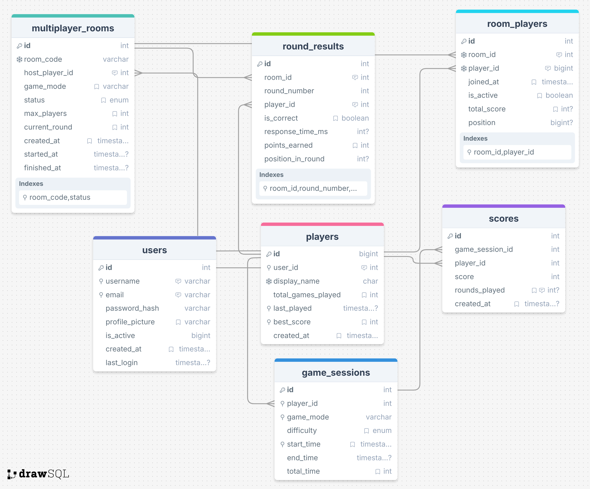

9. ## Implementációs terv:

   - Web:
   
   A webes felület HTML5, CSS3 és JavaScript nyelven készül. A technológiákat külön fájlokba írva készítjük, és úgy csatoljuk össze, hogy jobb legyen az átláthatóság, könnyebb a változtathatóság és a bővítés. A frontend a backend REST API metódusait használja, így képes adatokat felvinni és lekérdezni az adatbázisból.

   A backend Flask keretrendszerrel készül, ami megkönnyíti a kommunikációt a MySQL szerver és a kliens között. Moduláris Blueprint architektúrát használ, amely lehetővé teszi a kód logikai csoportosítását. Az alkalmazás Factory Pattern-tel inicializálódik, ahol regisztrálódnak a Blueprint-ek: autentikáció, játékmenet, eredmények és statikus fájlok kezelése. A konfiguráció környezeti változókból töltődik be, amelyek a MySQL kapcsolati adatokat, a Flask beállításokat (host, port, debug mód, secret_key), valamint a fájl útvonalakat tartalmazza. Minden konfigurációs értéknek van alapértelmezett értéke fejlesztési környezethez.

   A backend biztonsági megoldásai közé tartozik a jelszó hashing bcrypt algoritmussal, a Flask session-alapú autentikáció secret_key-vel, valamint a paraméterezett SQL lekérdezések használata SQL injection ellen. Minden felhasználói input validálva van a backend oldalon. Az adatbázis kapcsolatkezelés context manager használatával történik az automatikus cleanup és hibakezelés érdekében. A hibakezelés JSON formátumú válaszokkal történik, amelyek nem expozálják a belső hibákat. A HTTP error handler-ek (404, 500, 405) szintén JSON válaszokat adnak.

   Az autentikáció és felhasználókezelés a következő végpontokat tartalmazza: felhasználó regisztrációja validációval, bejelentkezés session kezeléssel, kijelentkezés, aktuális felhasználó adatainak lekérése, valamint felhasználói adatok frissítése (felhasználónév, jelszó). A validációs függvények ellenőrzik az email cím formátumát és egyediségét, a felhasználónevet (3-50 karakter, alfanumerikus karakterek és aláhúzás, egyediség ellenőrzés), valamint a jelszót (minimum 8 karakter, kis- és nagybetű, szám, speciális karakter kötelező). A jelszó erősség értékelése is támogatott (gyenge/közepes/erős kategóriák).

   A játékmenet kezelése a következő funkciókat tartalmazza: új játék indítása, ahol létrejön vagy visszaadódik a játékos, és létrejön a game session; aktuális játék session információinak lekérése; játék session lezárása. A rendszer tartalmazza a főoldal, játékmód választó oldal, valamint a két játékoldal renderelését. A helper függvények visszaadják a nehézségi szint beállításait (idő, párok száma), valamint validálják a nehézségi szinteket ('easy', 'medium', 'hard') és a játékmódokat ('color-hunter', 'card-match','fractal').

   Az eredmények kezelése a következő funkciókat tartalmazza: eredmény mentése game session-hez kapcsolva, eredmények lekérése globális vagy saját nézetben, szűréssel játékmód/difficulty szerint, rendezéssel és lapozással, valamint játékosok listájának lekérése. A felhasználó/játékos műveletek közé tartozik a regisztrált felhasználóhoz játékos létrehozása, vendég játékos létrehozása user_id nélkül, játékos lekérése vagy létrehozása display_name alapján, játékos lekérése user_id alapján, valamint játékos statisztikák frissítése (total_games_played, best_score, last_played).

   A MySQL adatbázisban négy relációs tábla valósul meg hierarchikus kapcsolatokkal. Az adatbázis inicializálása automatikusan történik, amely létrehozza az adatbázist és a táblákat, ha azok nem léteznek. Az adatbázis magja a users tábla, amely az alapvető felhasználói fiókokat tárolja egyedi azonosítóval, felhasználónévvel, email címmel, titkosított jelszóval bcrypt hasheléssel, profilkép elérési úttal, aktív státusszal, valamint a regisztráció és utolsó bejelentkezés időpontjaival. A táblán indexek találhatók a username és email mezőkön a gyors keresésért.

   A players tábla a játékos profilokat kezeli, amely kapcsolódik a users táblához user_id külső kulccsal. Itt található a játékos egyedi azonosítója, a megjelenítendő név, az összes játszott játék száma, a legjobb pontszám, valamint az utolsó játék időpontja és a profil létrehozásának időbélyege. Vendég játékosok esetén a user_id NULL értéket vesz fel, lehetővé téve a regisztráció nélküli játékot. A táblán indexek találhatók a user_id, display_name, best_score, és last_played mezőkön.

   A game_sessions tábla rögzíti a játék munkamenetek részleteit, beleértve a játékos azonosítóját, a játékmód típusát ('color-hunter', 'card-match' vagy 'fractal'), a nehézségi szintet ('easy', 'medium', 'hard'), valamint a munkamenet kezdetét és végét, valamint a teljes játékidőt másodpercekben. A táblán indexek találhatók a player_id, game_mode, és start_time mezőkön.

   Végül a scores tábla tárolja a játékosok pontszámait és teljesítményét, kapcsolódva mind a game_sessions, mind a players táblákhoz. Itt található az elért pontszám, a játszott körök száma, és különösen fontos a game_time mező, amely a játék idejét tárolja másodpercekben. Kiemelendő, hogy ezt az időt a kliens oldal számolja ki és küldi a szervernek, ezzel biztosítva, hogy ne legyenek eltérések az időmérésben a különböző rendszerek között. Az eredmény rögzítésének időpontját a created_at mező tárolja. A kapcsolódások ON DELETE CASCADE szabályt használnak az adatintegritás biztosításához. A táblán indexek találhatók a game_session_id, player_id, score, és created_at mezőkön. Minden tábla InnoDB engine-t használ, utf8mb4 charset-tel és utf8mb4_hungarian_ci collation-nal.

   A multiplayer játékok támogatásához további három tábla szükséges:
   
   A multiplayer_rooms tábla tárolja a multiplayer szobák információit, beleértve az egyedi 6 karakteres szoba kódot, a host játékos azonosítóját, a játékmód típusát ('color-hunter-multiplayer'), a szoba státuszát ('waiting', 'playing', 'finished'), a maximum játékosok számát (alapértelmezetten 6), az aktuális kör számát, valamint a szoba létrehozásának, indításának és befejezésének időpontjait. A táblán indexek találhatók a room_code és status mezőkön.
   
   A room_players tábla kezeli a szobákban lévő játékosokat, kapcsolódva a multiplayer_rooms és players táblákhoz. Itt található a játékos egyedi azonosítója, a szobához való csatlakozás időpontja, az aktív státusz (is_active), a játékos összpontszáma (total_score), valamint a végső helyezés (position). A táblán egyedi kulcs biztosítja, hogy egy játékos csak egyszer legyen egy szobában.
   
   A round_results tábla rögzíti a multiplayer játékok körönkénti eredményeit, kapcsolódva a multiplayer_rooms és players táblákhoz. Itt található a kör száma, a játékos azonosítója, a válasz helyessége (is_correct), a válaszidő milliszekundumban (response_time_ms), az elért pontok (points_earned), valamint a körön belüli helyezés (position_in_round). A táblán indexek találhatók a room_id és round_number kombinációján, valamint a player_id mezőn.

   A frontend architektúra a következő struktúrát használja: a főoldal, bejelentkezési, regisztrációs, és játékmód választó oldalak, valamint a hozzájuk tartozó scriptek és stílusok. A játékoldalak közé tartozik a színvadász játék oldala scripttel és stílusokkal, valamint a kártyapárosító játék oldala scripttel és stílusokkal. A képek mappájában találhatók a játék képei: 14 kép fájl a színvadász játékhoz, 8 elülső kép és 1 hátlap a kártyapárosító játékhoz, valamint az ikon képek.

   Az API kommunikáció helper függvényekkel történik, amelyek a Fetch API-t használják same-origin credentials beállítással a Flask session cookie-k támogatásához. A kérések JSON formátumban történnek, a POST kéréseknél Content-Type: application/json headerrel. A hibakezelés try-catch blokkokkal történik, felhasználóbarát hibaüzenetekkel. Az adattárolás LocalStorage-ban történik a játékos név, player_id, és nehézség tárolásához, valamint Flask session-ben az autentikáció és felhasználói adatok tárolásához.

   A játék logika három játékmódot tartalmaz: a színvadász időzítő alapú memória játék, ahol a célkép megjelenik időzítővel (nehézségtől függően: easy 10 másodperc, medium 5 másodperc, hard 3 másodperc), majd választási lehetőségek jelennek meg (4 kép közül választás), és helyes válasz esetén +1 pont jár. A kártyapárosító memória játék kártyapárosítással, ahol kártyák fordíthatók animációval, párosítási logika működik (2 kártya egyidejűleg nyitva), lépésszám számolás történik, és pontszámítás a párok száma alapján (nehézségtől függően: easy 3 pár, medium 4 pár, hard 6 pár). A fraktál játékmód a kártyapárosító játék egy speciális változata, ahol a kártyák előlapján dinamikusan generált fraktál képek jelennek meg. Minden pár két, egymáshoz nagyon hasonló fraktálvariánsból áll, a kártyák forgathatók animációval, a párosítási logika (egyszerre legfeljebb 2 nyitott kártya) ugyanúgy működik, a rendszer lépésszámot számol, és a pontszámítás a megtalált párok száma alapján történik (nehézségtől függően: easy 3 pár, medium 4 pár, hard 6 pár). Mindhárom játékmódban az eredmény mentése backend-re történik játék végén.

   A multiplayer játékmenet kezelése a következő komponensekből áll:
   
   A multiplayer rendszer Flask-SocketIO-t használ a valós idejű kommunikációhoz. A SocketIO inicializálása az alkalmazás Factory Pattern inicializálásakor történik, és event handler-eket regisztrál a következő eseményekhez: connect (kapcsolat létrejött), disconnect (kapcsolat megszakadt), join_room (szobához csatlakozás), start_game (játék indítása, csak host), player_answer (játékos válasza).
   
   A multiplayer API végpontok közé tartozik: szoba létrehozása (POST /api/multiplayer/create-room), amely egyedi 6 karakteres kódot generál és létrehozza a szobát az adatbázisban; szobához csatlakozás (POST /api/multiplayer/join-room/<room_code>), amely ellenőrzi a szoba létezését és kapacitását; szoba információk lekérése (GET /api/multiplayer/room-info/<room_code>), amely visszaadja a szoba állapotát.
   
   A multiplayer játékmenet last man standing mechanikával működik. Minden körben egy célkép jelenik meg 5 másodpercig, majd 4 választási lehetőség közül kell választani. A hibás válasz vagy a leglassabb válaszadás esetén a játékos kiesik. A helyes válaszok esetén pontokat osztanak a leggyorsabb játékosoknak (1. hely = 3 pont, 2. hely = 2 pont, 3. hely = 1 pont). Ha 4 vagy több játékos helyesen válaszol, a leglassabb kiesik. A játék addig tart, amíg csak 1 játékos marad aktív.
   
   A multiplayer szoba állapot kezelése in-memory történik egy RoomState osztály segítségével, amely tárolja a játékosokat, a játék állapotát, az aktuális kört, a válaszokat és a pontszámokat. Az adatbázisban a szobák automatikusan törlődnek 1 óra inaktivitás után, míg az in-memory állapot 30 másodperc után törlődik a játék vége után.

   A reszponzív design CSS Media queries használatával valósul meg különböző képernyőméretekhez, Flexbox és Grid layout technikákkal, mobil-barát felülettel (touch-friendly gombok, megfelelő méretezés). A statikus fájlok szolgáltatása a Flask template rendszeren keresztül történik, valamint route-okon keresztül. A tesztelési stratégia Cypress end-to-end teszteket tartalmaz, valamint Python unit teszteket és integration teszteket pytest keretrendszerrel. A tesztelendő funkciók közé tartozik a játék logika, scoreboard, kártya fordítás, validáció, autentikáció, és adatbázis műveletek.

10. ## Tesztterv:

   A tesztelések célja a rendszer és komponensei funkcionalitásának teljes vizsgálata, ellenőrzése, a rendszer által megvalósított üzleti szolgáltatások verifikálása. A tesztelés három szinten történik: unit tesztek, integrációs tesztek, és end-to-end tesztek.

- **Unit tesztek:**
  A fejlesztési folyamat során folyamatosan teszteljük a metódusok funkcionalitását. Minden metódushoz unit teszteket írunk, amelyekkel minél nagyobb kódlefedettséget érjük el. Egy metódus akkor tekinthető késznek, ha a hozzá tartozó tesztesetek hiba nélkül lefutnak. A unit tesztek Python unittest keretrendszerrel készülnek, mock objektumok használatával az adatbázis függőségek izolálásához.
  
- **Integrációs tesztek:**
  Az integrációs tesztek a backend API endpoint-ok működését tesztelik valós HTTP kérésekkel, adatbázis kapcsolattal és session kezeléssel. A tesztek a teljes request-response ciklust ellenőrzik, és a különböző rendszerkomponensek (API, adatbázis, session) együttműködését verifikálják. Az integrációs tesztek Python requests könyvtárral készülnek, valós környezetben futnak (nem mock-olják az adatbázis vagy HTTP kapcsolatokat), így a teljes működési lánc tesztelésére alkalmasak. A tesztek során ellenőrizzük az API endpoint-ok helyes válaszait, az adatbázis műveletek sikerességét, a session kezelés működését, valamint a hibakezelést és validációt a teljes rendszerben.

- **Tesztelendő funkciók:**

  **Validátor függvények:**
  Email cím validáció tesztelése: érvényes email címek ellenőrzése (test@example.com, user.name@domain.co.uk, user+tag@example.org), érvénytelen email címek ellenőrzése (invalid formátum, hiányzó részek, szóközök), valamint email egyediség ellenőrzés adatbázisban. Felhasználónév validáció tesztelése: érvényes felhasználónevek ellenőrzése (3-50 karakter, alfanumerikus karakterek és aláhúzás), érvénytelen felhasználónevek ellenőrzése (túl rövid, túl hosszú, érvénytelen karakterek, szóközök, kötőjelek), valamint felhasználónév egyediség ellenőrzés adatbázisban. Jelszó validáció tesztelése: érvényes jelszavak ellenőrzése (minimum 8 karakter, kis- és nagybetű, szám, speciális karakter), gyenge jelszavak ellenőrzése (túl rövid, nincs nagybetű, nincs kisbetű, nincs szám, nincs speciális karakter), valamint jelszó erősség értékelés (gyenge/közepes/erős kategóriák). Regisztrációs adatok validáció tesztelése: érvényes regisztrációs adatok ellenőrzése (username, email, password mezők jelenléte és validitása), hiányzó mezők ellenőrzése regisztrációnál. Bejelentkezési adatok validáció tesztelése: érvényes bejelentkezési adatok ellenőrzése (username, password mezők jelenléte), hiányzó mezők ellenőrzése bejelentkezésnél. Eredmény adatok validáció tesztelése: érvényes score adatok ellenőrzése (player_id, score, game_mode, rounds_played, game_time, difficulty), hiányzó mezők ellenőrzése score adatoknál, érvénytelen értékek ellenőrzése (negatív score, negatív game_time, rounds_played < 1, érvénytelen game_mode, érvénytelen difficulty), valamint edge case-ek (nulla értékek, nagy értékek, opcionális mezők hiánya).

  **Segédfüggvények:**
  Nehézségi beállítások tesztelése: különböző nehézségi szintek (easy, medium, hard) beállításainak ellenőrzése (idő: 10, 5, 3 másodperc, párok száma: 3, 4, 6), valamint alapértelmezett érték ellenőrzése érvénytelen nehézségi szint esetén. Nehézségi szint validáció tesztelése: érvényes nehézségi szintek ellenőrzése ('easy', 'medium', 'hard'), érvénytelen nehézségi szintek ellenőrzése. Játékmód validáció tesztelése: érvényes játékmódok ellenőrzése ('color-hunter', 'card-match' vagy 'fractal'), érvénytelen játékmódok ellenőrzése. Entitás létezés validáció tesztelése: entitás létezés ellenőrzése adatbázisban (sikeres eset, nem található eset, érvénytelen tábla név, nincs adatbázis kapcsolat).

  **User model függvények:**
  Játékos létrehozás felhasználóhoz tesztelése: sikeres játékos létrehozás felhasználóhoz (user_id, username megadása, player_id visszaadása), sikertelen játékos létrehozás (nincs kapcsolat, exception kezelés). Vendég játékos létrehozás tesztelése: sikeres vendég játékos létrehozás (user_id nélkül, display_name megadása, player_id visszaadása). Játékos lekérése vagy létrehozása tesztelése: létező játékos lekérése (display_name alapján, last_played frissítése), új vendég játékos létrehozása (user_id nélkül), új játékos létrehozása user_id-vel. Játékos lekérése user_id alapján tesztelése: player lekérése user_id alapján (sikeres eset, nem található eset). Játékos statisztikák frissítése tesztelése: player statisztikák frissítése (total_games_played növelése, best_score frissítése ha szükséges, last_played beállítása), sikertelen frissítés (exception kezelés).

  **Adatbázis függvények:**
  Adatbázis kapcsolat tesztelése: sikeres adatbázis kapcsolat létrehozása, sikertelen adatbázis kapcsolat (hiba kezelés, None visszaadás).

  **Edge case-ek:**
  Speciális esetek tesztelése: score adatok edge case tesztjei (nulla értékek, nagy értékek, opcionális mezők hiánya), felhasználónév edge case tesztjei (maximum hossz, aláhúzás kezdés/vég, számmal kezdés, csak nagybetűk), jelszó edge case tesztjei (pontosan 8 karakter, 7 karakter).

- **Integrációs tesztek:**
  Az integrációs tesztek a backend API endpoint-ok működését tesztelik valós HTTP kérésekkel, adatbázis kapcsolattal, és session kezeléssel. A tesztek Python requests könyvtárral készülnek, és a teljes request-response ciklust ellenőrzik.

  **Health check tesztelése:**
  Health check endpoint tesztelése: `/api/health` endpoint válaszának ellenőrzése (200 status code, JSON válasz, adatbázis státusz).

  **Játék funkciók tesztelése:**
  Új játék indítása tesztelése: `/api/game` (POST) endpoint tesztelése (játékos név megadása, player_id visszaadása, game_session_id visszaadása, game_mode és difficulty beállítása). Játék session lekérése tesztelése: `/api/game/session` (GET) endpoint tesztelése (aktív session információk visszaadása). Játék session lezárása tesztelése: `/api/game/session/end` (POST) endpoint tesztelése (session lezárása, total_time beállítása).

  **Eredmények kezelése tesztelése:**
  Eredmény mentése tesztelése: `/api/save` (POST) endpoint tesztelése (player_id, score, game_mode, difficulty, game_time, rounds_played megadása, game_session_id kapcsolása, adatbázisba mentés, player statisztikák frissítése). Eredmények lekérése tesztelése: `/api/scores` (GET) endpoint tesztelése (globális ranglista lekérése, saját eredmények lekérése scope=me paraméterrel, szűrés game_mode és difficulty szerint, rendezés különböző módon (score_desc, score_asc, time_asc, time_desc, date_desc, date_asc), lapozás (limit, page paraméterek), pagination információ visszaadása). Játékosok lekérése tesztelése: `/api/players` (GET) endpoint tesztelése (játékosok listája, last_played szerint rendezve, limit beállítás).

  **Autentikáció és felhasználókezelés tesztelése:**
  Felhasználó regisztráció tesztelése: `/api/register` (POST) endpoint tesztelése (username, email, password megadása, validáció, adatbázisba mentés, player létrehozása, session beállítása, már létező felhasználó kezelése). Felhasználó bejelentkezés tesztelése: `/api/login` (POST) endpoint tesztelése (username, password megadása, session beállítása, last_login frissítése, hibás credentials kezelése). Aktuális felhasználó lekérése tesztelése: `/api/current-user` (GET) endpoint tesztelése (session alapú user adatok visszaadása, bejelentkezés nélküli hozzáférés kezelése). Felhasználói adatok frissítése tesztelése: `/api/user/update` (PATCH) endpoint tesztelése (felhasználónév módosítása, jelszó módosítása current_password megadásával, validációs hibák kezelése (gyenge jelszó, hiányzó current_password), players.display_name szinkronizálása username változáskor).

  **Scores funkciók részletes tesztelése:**
  Scores global és me nézet tesztelése: regisztráció, bejelentkezés, eredmény mentése, globális ranglista lekérése (scope=global), saját eredmények lekérése (scope=me, authentication szükséges), user update funkciók tesztelése (username módosítás, jelszó módosítás, új jelszóval bejelentkezés). Scores szűrők, rendezés, lapozás tesztelése: game_mode és difficulty szerinti szűrés, különböző rendezési módozatok tesztelése (time_asc, score_desc stb.), lapozás tesztelése (limit, page paraméterek), második oldal lekérése. Scope=me authentication requirement tesztelése: bejelentkezés nélküli hozzáférés scope=me paraméterrel (401 status code várható).

  **Hibakezelés tesztelése:**
  Hibás kérések tesztelése: hiányzó adatok kezelése (400 status code), érvénytelen game_mode kezelése (400 status code), érvénytelen difficulty kezelése (400 status code), érvénytelen player_id kezelése (404 status code). Validációs hibák tesztelése: gyenge jelszó kezelése user update-nél (400 status code), hiányzó current_password kezelése jelszó módosításnál (400 status code), hibás current_password kezelése (401 status code).

  **Teljesítmény tesztelése:**
  Alapvető teljesítmény tesztelése: több párhuzamos kérés tesztelése, válaszidő mérése, átlagos válaszidő számítása, elfogadható teljesítmény ellenőrzése (3 kérés 8 másodperc alatt).

- **End-to-end tesztek (Cypress):**
  Az end-to-end tesztek a teljes felhasználói folyamatot tesztelik böngészőben, a frontend és backend együttműködését ellenőrizve. A tesztek Cypress keretrendszerrel készülnek, amely lehetővé teszi a böngésző automatizálását és a felhasználói interakciók szimulálását.

  **Autentikációs oldalak tesztelése:**
  Bejelentkezési oldal tesztelése: bejelentkezési oldal megjelenítése (`/login`), felhasználónév input mező láthatósága és működése, jelszó input mező láthatósága és működése, regisztrációs oldalra való navigáció (register-link kattintása, URL ellenőrzése registration.html-re). Regisztrációs oldal tesztelése: regisztrációs oldal megjelenítése (`/registration`), felhasználónév input mező láthatósága és működése, email input mező láthatósága és működése, jelszó input mezők láthatósága és működése, submit gomb láthatósága.

  **Főoldal tesztelése:**
  Főoldal funkciók tesztelése: főoldal megjelenítése (`/`), scoreboard láthatósága és működése (legjobb eredmények táblázat megjelenítése), játékos név input mező láthatósága és működése, START gomb láthatósága és működése, játékos név megadása és játék indítása.

  **Játékmód választó tesztelése:**
  Játékmód választó funkciók tesztelése: játékmód választó oldal megjelenítése (`/menu`), nehézségi szint választó láthatósága ("Válaszd ki a nehézségi szintet" szöveg, könnyű/közepes/nehéz gombok), nehézségi szint kiválasztása (közepes nehézség kiválasztása), játékmód választó láthatósága (mode-row, mode-item elemek), játékmód kiválasztása (első játékmód kiválasztása), START gomb láthatósága és működése, játék indítása kiválasztott nehézségi szinttel és játékmóddal.

  **Játék logika tesztelése:**
  A játék logika tesztelése a frontend JavaScript kódon keresztül történik, ahol a játék mechanikákat ellenőrizzük. Színvadász játék tesztelése: időzítő alapú memória játék működésének ellenőrzése (célkép megjelenítése időzítővel, nehézségtől függő időzítő beállítása: easy 10 másodperc, medium 5 másodperc, hard 3 másodperc), választási lehetőségek megjelenítése (4 kép közül választás), pontszámítás ellenőrzése (helyes válasz esetén +1 pont), eredmény mentése backend-re játék végén. Kártyapárosító játék tesztelése: memória játék kártyapárosítással működésének ellenőrzése (kártya fordítás animációval, párosítási logika: 2 kártya egyidejűleg nyitva, lépésszám számolás, pontszámítás a párok száma alapján: easy 3 pár, medium 4 pár, hard 6 pár), kártya visszafordulásának ellenőrzése (rossz párosítás esetén), eredmény mentése backend-re játék végén.

  **Scoreboard tesztelése:**
  Scoreboard funkciók tesztelése: adatbázisból való adatlekérés ellenőrzése (backend API hívás `/api/scores` endpoint-ra), nevek és score-ok megfelelő megjelenítése frontend-en, adatok formázása és rendezése, üres scoreboard kezelése (nincs elérhető eredmény esetén), hálózati hibák kezelése (nem sikerült betölteni az eredményeket esetén).

  **Adatintegritás és validáció tesztelése:**
  Adatintegritás tesztelése: frontend-ből backend-re küldött adatok formátumának ellenőrzése (JSON formátum, megfelelő mezők jelenléte), backend-ből frontend-re érkező adatok formátumának ellenőrzése (JSON formátum, megfelelő struktúra), adatbázisban való tárolás ellenőrzése (adatbázis lekérdezés, adatok egyezése). Validáció tesztelése: frontend validáció ellenőrzése (üres mezők, érvénytelen formátumok), backend validáció ellenőrzése (API válaszok, hibaüzenetek), validációs hibák megfelelő kezelése (felhasználóbarát hibaüzenetek megjelenítése).

  **Kommunikáció tesztelése:**
  API kommunikáció tesztelése: REST API kérések helyes formátuma (POST, GET, PATCH metódusok, Content-Type header, JSON body), API válaszok helyes formátuma (JSON formátum, success flag, error üzenetek), session kezelés ellenőrzése (cookie-k, session adatok), credentials kezelés (same-origin policy).

  **Multiplayer funkciók tesztelése:**
  Szoba létrehozása tesztelése: `/api/multiplayer/create-room` (POST) endpoint tesztelése (player_id megadása, egyedi room_code generálása, adatbázisba mentés, host_player_id beállítása). Szobához csatlakozás tesztelése: `/api/multiplayer/join-room/<room_code>` (POST) endpoint tesztelése (room_code megadása, szoba létezés ellenőrzése, kapacitás ellenőrzése, játékos hozzáadása). Szoba információk lekérése tesztelése: `/api/multiplayer/room-info/<room_code>` (GET) endpoint tesztelése (szoba állapot visszaadása, játékosok száma).
  
  **WebSocket kommunikáció tesztelése:**
  SocketIO kapcsolat tesztelése: WebSocket kapcsolat létrejöttének ellenőrzése, disconnect esemény kezelése. Szobához csatlakozás WebSocket-en keresztül tesztelése: join_room esemény küldése, room_joined válasz ellenőrzése, player_joined esemény fogadása más játékosok számára. Játék indítása tesztelése: start_game esemény küldése (csak host), round_start esemény fogadása, show_choices esemény fogadása. Játékos válasz tesztelése: player_answer esemény küldése, round_end esemény fogadása, game_end esemény fogadása játék végekor.
  
  **Multiplayer játékmenet tesztelése:**
  Last man standing mechanika tesztelése: hibás válasz esetén kiesés ellenőrzése, leglassabb válasz esetén kiesés ellenőrzése (4+ helyes válasz esetén), pontszámítás ellenőrzése (1-3. helyezett pontjai). Körönkénti játékmenet tesztelése: több kör lejátszása, válaszidő mérése, pontszámok frissítése körönként. Végső ranglista tesztelése: játék vége esemény, végső pontszámok és helyezések ellenőrzése.
 11. ## Tesztriport:
 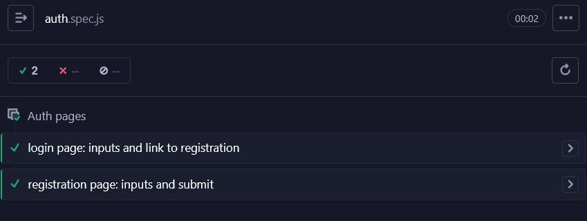
 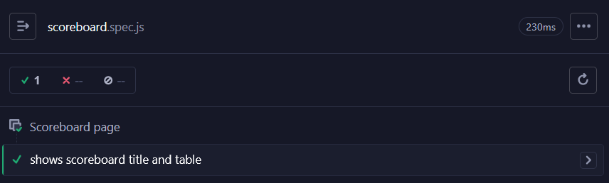
 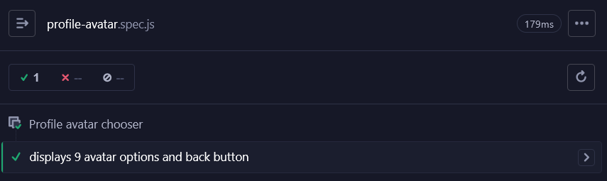
 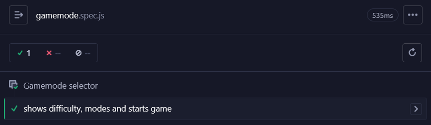
 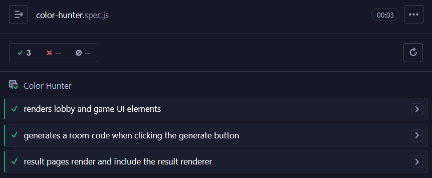
 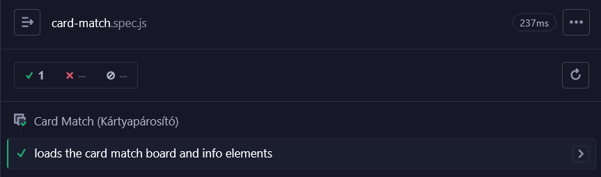
 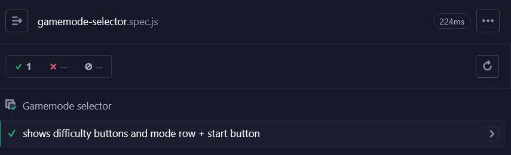
 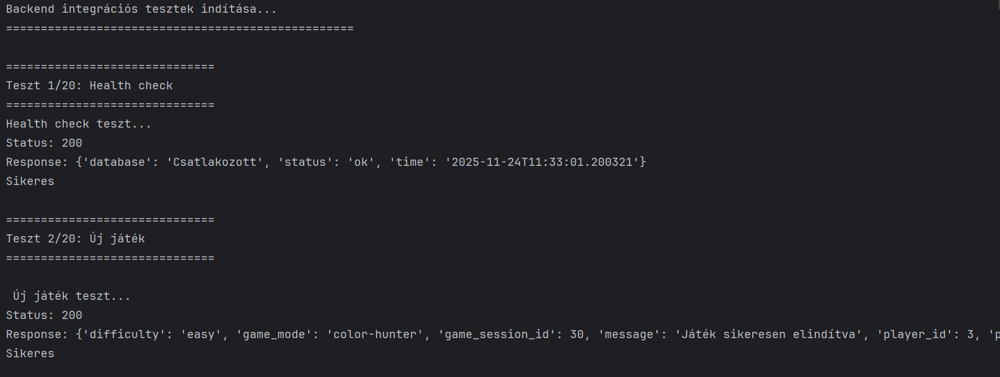
 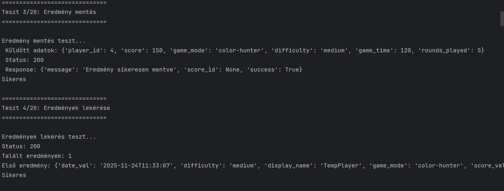
 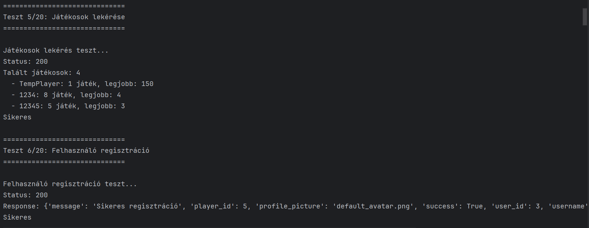
 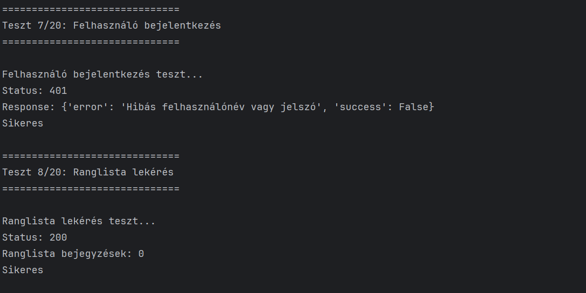
 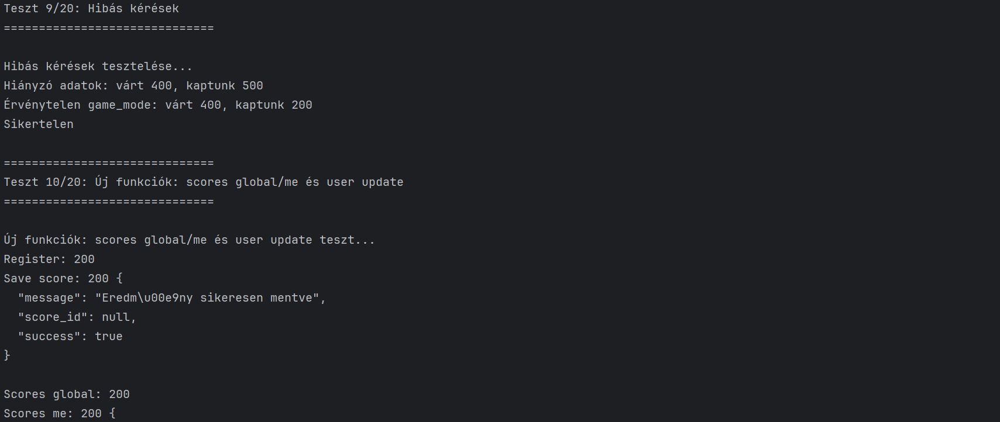
 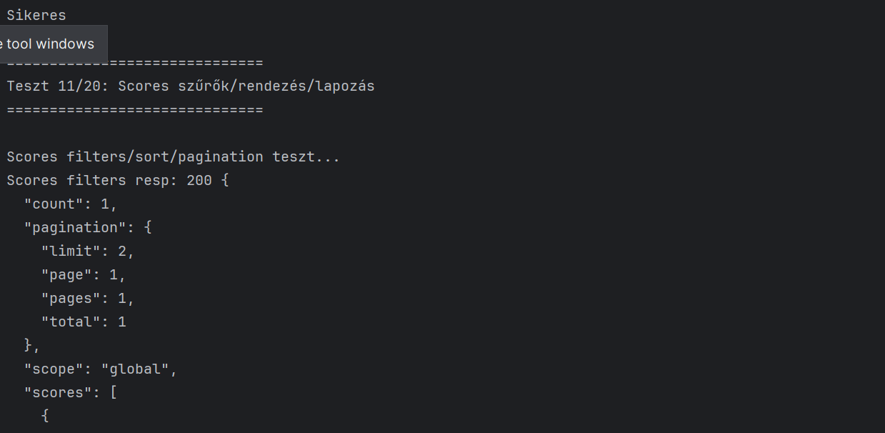
 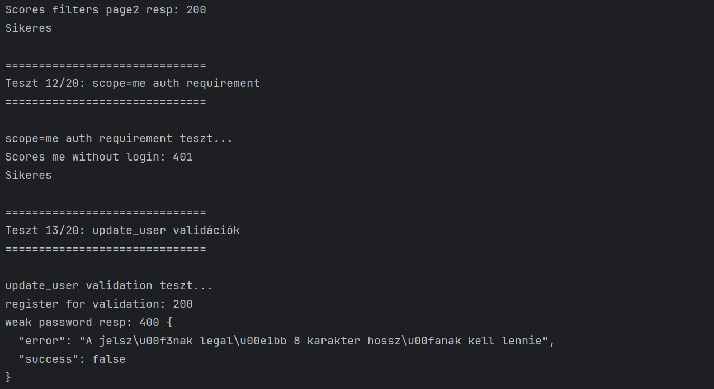
 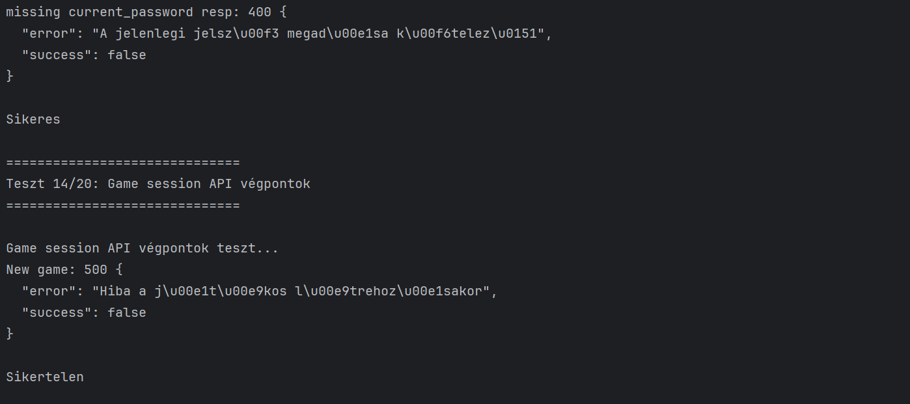
 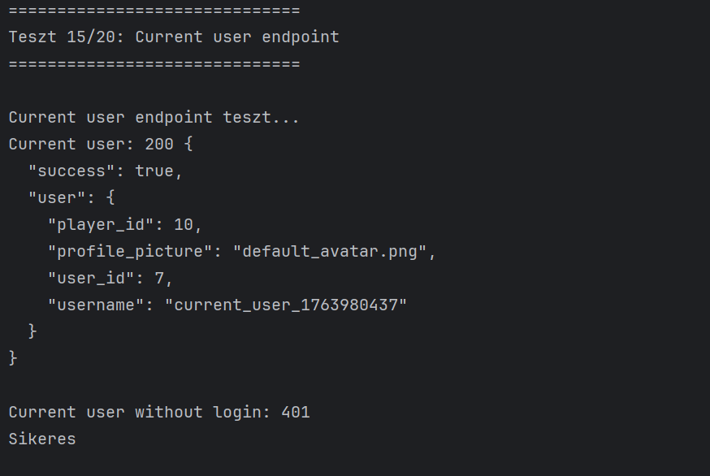
 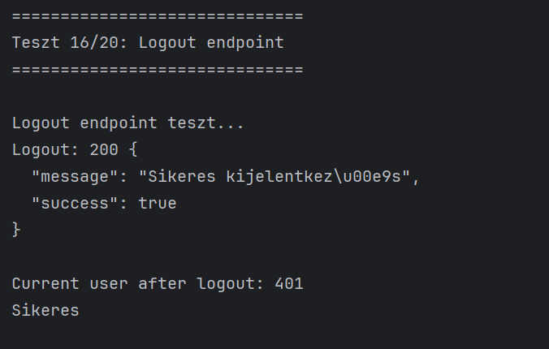
 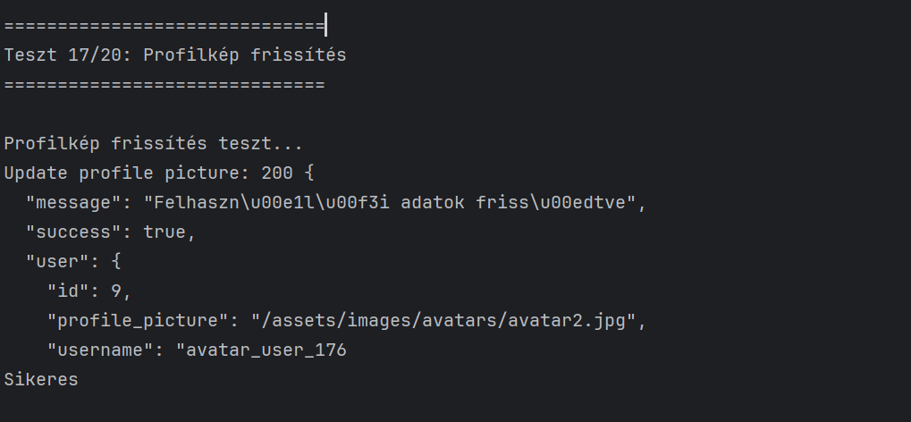
 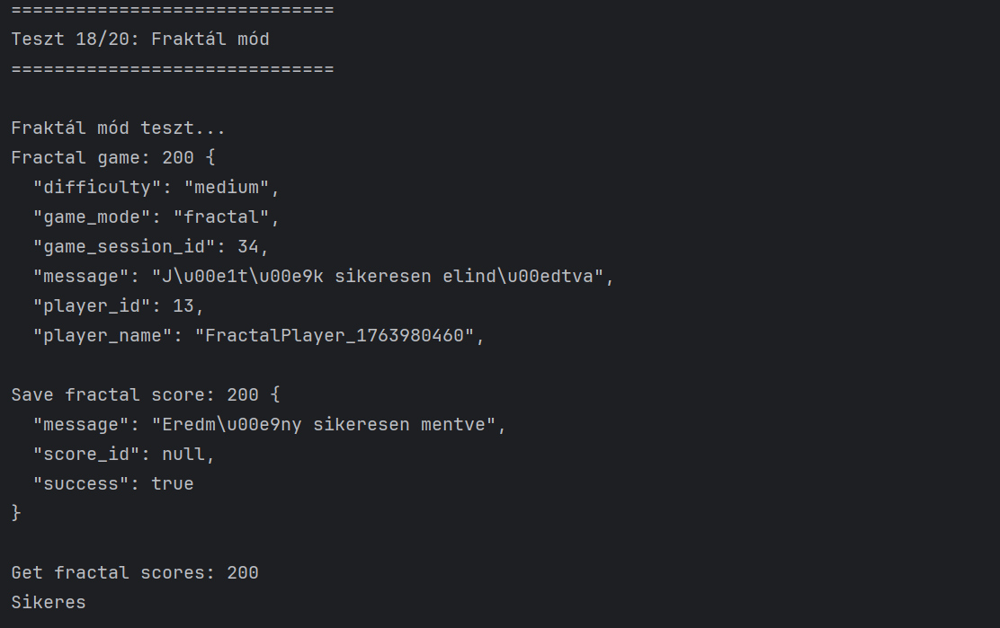
 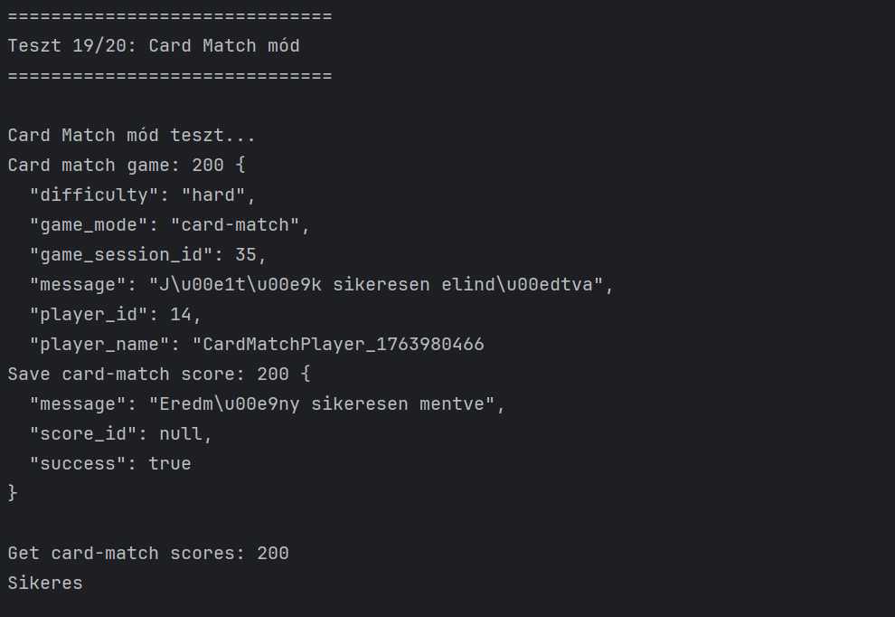
 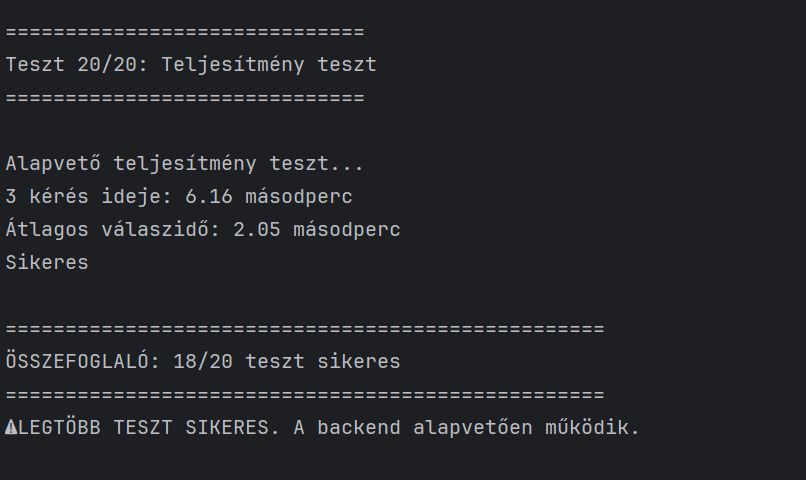
 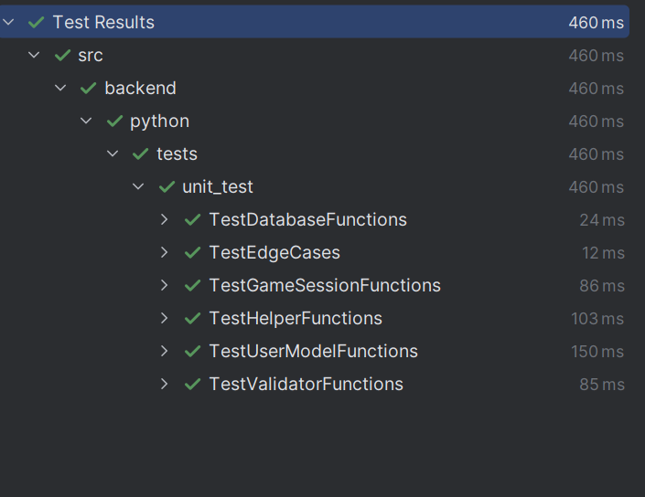
 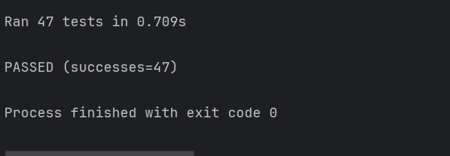